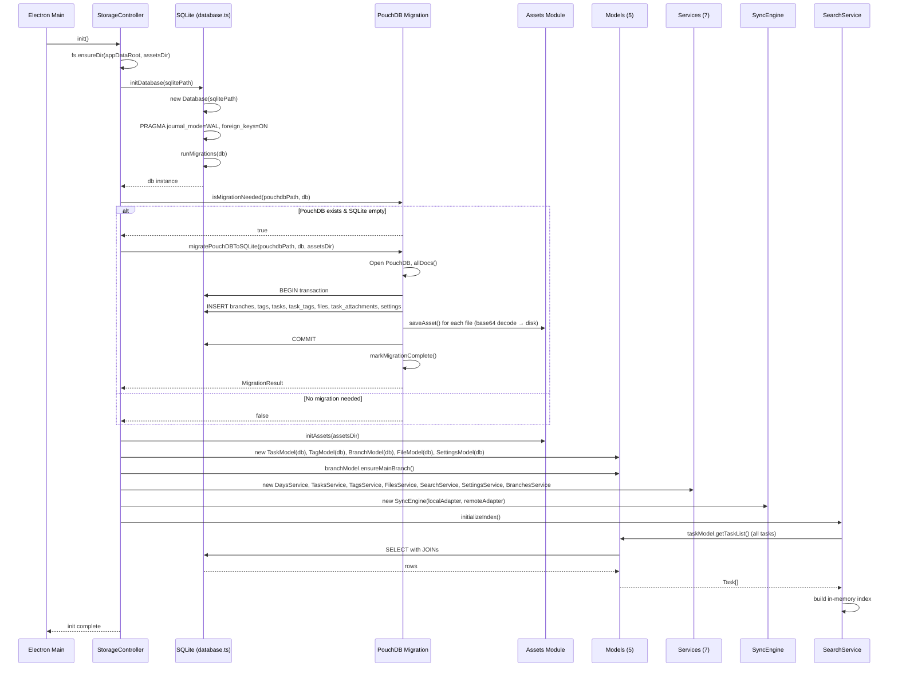
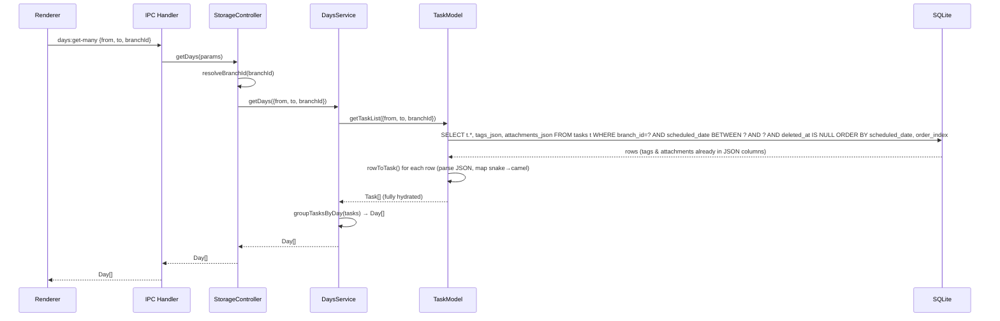
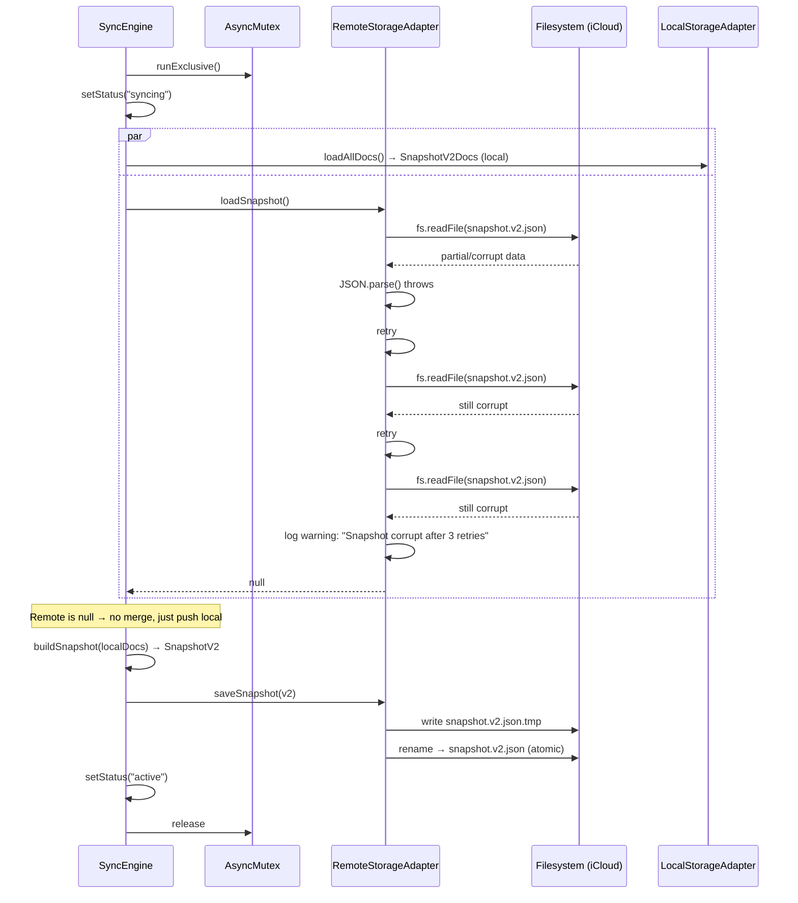
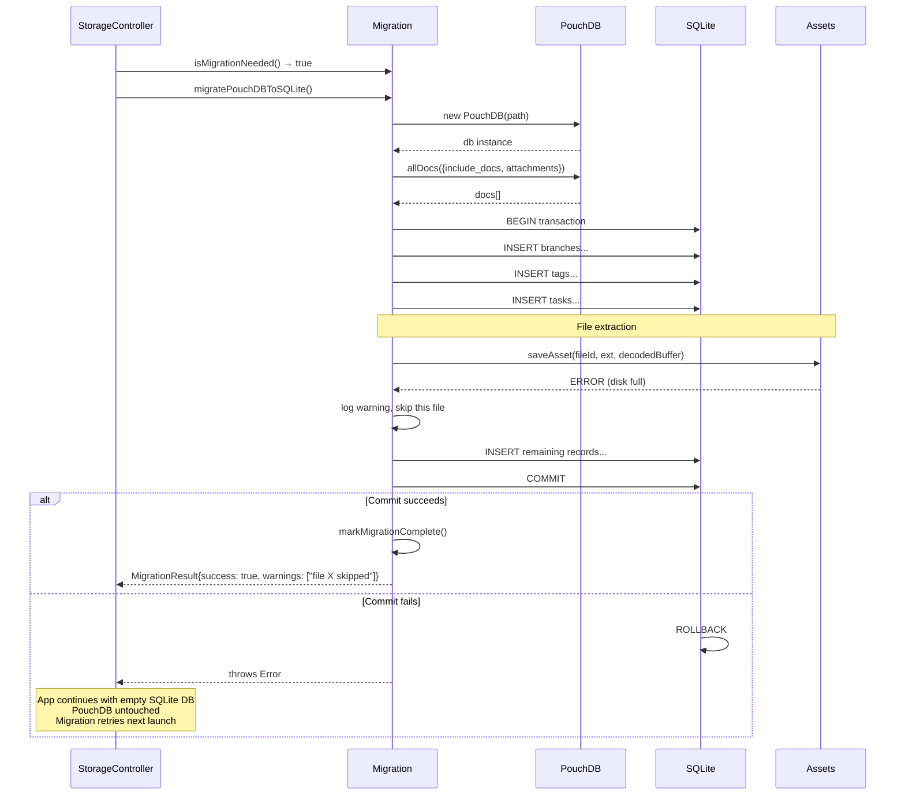
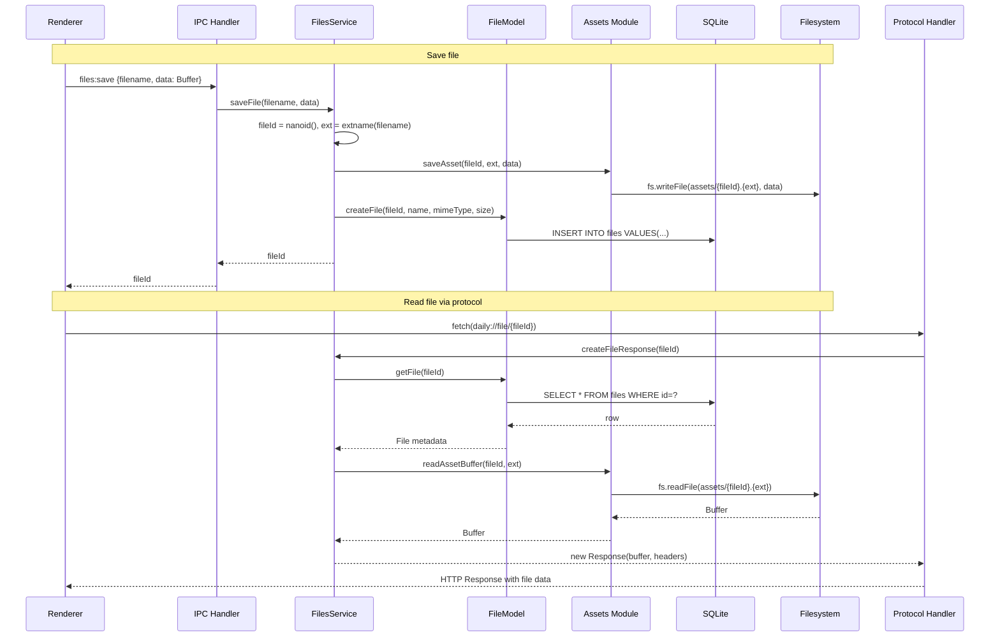

# 03 — Sequence Diagrams: SQLite Migration

## 1. Application Init (Main Success Path)



## 2. getDays (Main Success Path)



## 3. iCloud Sync (Success Path)

```mermaid
sequenceDiagram
    participant Sched as Scheduler (5-min)
    participant SE as SyncEngine
    participant Mutex as AsyncMutex
    participant LA as LocalStorageAdapter
    participant RA as RemoteStorageAdapter
    participant DB as SQLite
    participant FS as Filesystem (iCloud)
    participant Merge as mergeRemoteIntoLocal

    Sched->>SE: sync("pull")
    SE->>Mutex: runExclusive()
    Mutex-->>SE: lock acquired
    SE->>SE: setStatus("syncing")

    par Load local and remote
        SE->>LA: loadAllDocs()
        LA->>DB: SELECT * FROM tasks, tags, branches, files, settings, task_tags, task_attachments
        DB-->>LA: rows
        LA-->>SE: SnapshotV2Docs (local)
    and
        SE->>RA: loadSnapshot()
        RA->>FS: check .icloud placeholder
        RA->>FS: fs.readFile(snapshot.v2.json) with retry
        RA->>RA: JSON.parse + validate + detect version
        RA-->>SE: Snapshot (v1 or v2)
    end

    alt Remote is v1
        SE->>SE: convertV1ToV2(remoteDocs)
    end

    SE->>SE: compare hashes
    alt Hashes differ
        SE->>Merge: mergeRemoteIntoLocal(local, remote, "pull", gcIntervalMs)
        Merge-->>SE: {resultDocs, toUpsert, toRemove, changes}

        SE->>LA: upsertDocs(toUpsert)
        LA->>DB: BEGIN; INSERT OR REPLACE ...; COMMIT
        SE->>LA: deleteDocs(toRemove)
        LA->>DB: BEGIN; DELETE ...; COMMIT

        SE->>SE: onDataChanged() → broadcast to renderer

        SE->>SE: compare result hash vs remote hash
        alt Push needed
            SE->>SE: buildSnapshot(resultDocs) → SnapshotV2
            SE->>RA: saveSnapshot(v2)
            RA->>FS: write snapshot.v2.json.tmp
            RA->>FS: rename → snapshot.v2.json (atomic)
        end

        SE->>RA: syncAssets(localAssetsDir, fileManifest)
        RA->>FS: copy new files local↔remote
    end

    SE->>SE: setStatus("active")
    SE->>Mutex: release
```

## 4. iCloud Sync (Error Path — Corrupt Snapshot)



## 5. PouchDB Migration (Error Path)



## 6. File Save + Protocol Read


