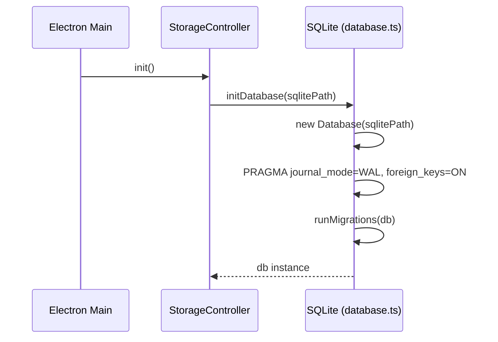

# Phase 01: Build Infrastructure + SQLite Foundation

## 1. Goal

Set up `better-sqlite3` as a dependency, configure electron-builder for the native module, create the SQLite database initialization module with WAL mode and pragmas, implement a versioned migration system with the v001 schema, and update `config.ts` with new path getters. At the end of this phase, the app builds and launches with an empty SQLite database created alongside the existing PouchDB — no behavior changes yet.

## 2. Context

### Current State Analysis

The app uses PouchDB (`^9.0.0`) with PouchDB-Find as its persistence layer. Database initialization lives in `src/main/storage/database.ts` (singleton pattern, 7 indexes). The build uses `electron-vite` with `externalizeDepsPlugin()` for native modules and `electron-builder` with ASAR packaging. Ad-hoc code signing happens in `scripts/afterPack-mac.js` using `codesign --deep --force --sign -` with JIT/native module entitlements.

**Key files:**

- `src/main/storage/database.ts` — PouchDB singleton init (lines 1-87)
- `src/main/config.ts` — path definitions using `app.getPath("userData")` and `process.env.HOME` for iCloud (lines 128-155)
- `electron-builder.json` — ASAR true, afterPack script, mac arm64 target (lines 1-33)
- `electron.vite.config.ts` — `externalizeDepsPlugin()` on main and preload (lines 1-79)
- `scripts/afterPack-mac.js` — ad-hoc signing with entitlements (lines 1-68)
- `package.json` — dependencies including `pouchdb ^9.0.0`, `pouchdb-find ^9.0.0` (lines 122-123)

### Architecture Context

**ADR-1 (from design/01-architecture.md):** Use `better-sqlite3` (synchronous, native N-API) as the sole persistence engine. Synchronous API simplifies transactions. WAL mode enables concurrent reads. Native performance meets <20ms `getDays` target.

**ADR-8 (from design/01-architecture.md):** One-time PouchDB→SQLite migration with rollback safety. No existing migration system — indexes are idempotently created on startup.

The existing `afterPack-mac.js` uses `codesign --deep --force --sign -` which re-signs all binaries inside the app bundle, including `better-sqlite3`'s `.node` binary.

### Similar Implementation

- `src/main/storage/database.ts:15-41` — Current PouchDB singleton pattern to replicate for SQLite

### Data Flow Steps (from design/02-data-flow.md, Application Init)

```
5. initDatabase(sqlitePath)           → ~/Library/Application Support/Daily/db/daily.sqlite
   5a. new Database(sqlitePath)       → better-sqlite3 opens/creates file
   5b. PRAGMA journal_mode = WAL
   5c. PRAGMA foreign_keys = ON
   5d. PRAGMA busy_timeout = 5000
   5e. PRAGMA synchronous = NORMAL
   5f. runMigrations(db)              → applies v001 if _migrations table empty
```

### Sequence Excerpt (from design/03-sequence.md)



### Key Discoveries

- `externalizeDepsPlugin()` in `electron.vite.config.ts:13` ensures native modules like `better-sqlite3` are NOT bundled but loaded from `node_modules` at runtime — same pattern as PouchDB
- `postinstall: "electron-builder install-app-deps"` in `package.json:33` rebuilds native modules for Electron — will automatically rebuild `better-sqlite3`
- `afterPack-mac.js` uses `codesign --deep` which signs all nested binaries including `.node` files
- `config.ts:14` uses `process.env.HOME` for iCloud path — design requires `app.getPath("home")`
- `config.ts:133` — `dbPath()` currently returns `~/Library/Application Support/Daily/db` (directory for PouchDB LevelDB files)
- No `assetsDir` or `remoteSyncAssetsPath` path getters exist yet

### Desired End State

- `better-sqlite3` and `@types/better-sqlite3` installed
- `electron-builder.json` configured for native module (if needed beyond existing `--deep` signing)
- `src/main/storage/database/instance.ts` exists with `initDatabase()`, `getDatabase()`, `closeDatabase()`
- `src/main/storage/database/scripts/migrate.ts` exists with `runMigrations()`, `rollbackLastMigration()`, `getAppliedMigrations()`
- `src/main/storage/database/migrations/index.ts` exports v001 migration
- v001 migration creates all 7 tables + 7 indexes + seeds main branch
- `config.ts` updated with `sqlitePath()`, `assetsDir()`, `remoteSyncAssetsPath()`, `oldDbPath()`, and `app.getPath("home")` for iCloud
- `pnpm build` succeeds on arm64, app launches, SQLite DB file created (but not yet used by the app)
- Existing PouchDB functionality remains fully operational

## 3. Files to Create or Modify

| File                                                          | Action | Why                                                                                                              |
| ------------------------------------------------------------- | ------ | ---------------------------------------------------------------------------------------------------------------- |
| `package.json`                                                | modify | Add `better-sqlite3` dependency, `@types/better-sqlite3` devDependency                                           |
| `src/main/storage/database/instance.ts`                       | create | SQLite init with WAL, pragmas, singleton pattern                                                                 |
| `src/main/storage/database/scripts/migrate.ts`                | create | Migration runner with version tracking                                                                           |
| `src/main/storage/database/migrations/index.ts`               | create | Migration registry exporting v001                                                                                |
| `src/main/storage/database/migrations/v001-initial-schema.ts` | create | Full schema: 7 tables, 7 indexes, main branch seed                                                               |
| `src/main/config.ts`                                          | modify | Add `sqlitePath`, `assetsDir`, `remoteSyncAssetsPath`, `oldDbPath`; fix iCloud path to use `app.getPath("home")` |
| `electron-builder.json`                                       | modify | Add `better-sqlite3` to `files` include if needed for ASAR                                                       |

## 4. Implementation Approach

1. **Install dependencies**
   - What to do: `pnpm add better-sqlite3` and `pnpm add -D @types/better-sqlite3`. Verify `postinstall` script runs `electron-builder install-app-deps` successfully.
   - Acceptance check: `node -e "require('better-sqlite3')"` runs without error. `pnpm install` completes with no native module errors.

2. **Create migration system**
   - What to do: Create `src/main/storage/database/scripts/migrate.ts` implementing:
     - `_migrations` table auto-creation: `CREATE TABLE IF NOT EXISTS _migrations (version INTEGER PRIMARY KEY, name TEXT NOT NULL, applied_at TEXT NOT NULL)`
     - `runMigrations(db)`: reads applied versions, applies pending migrations in order, each in its own transaction
     - `rollbackLastMigration(db)`: rolls back most recent migration using `down` SQL
     - `getAppliedMigrations(db)`: returns all applied records
     - Migration type: `{ version: number; name: string; up: string; down: string }`
   - Acceptance check: Module compiles. Can be imported and called with a test DB.

3. **Create v001 migration**
   - What to do: Create `src/main/storage/database/migrations/v001-initial-schema.ts` with:
     - `up`: CREATE TABLE for `branches`, `tags` (WITHOUT `sort_order`), `tasks`, `task_tags`, `files`, `task_attachments`, `settings` + 7 indexes + `INSERT OR IGNORE INTO branches` for main branch
     - `down`: DROP all indexes and tables in reverse dependency order
   - Create `src/main/storage/database/migrations/index.ts`:
     ```typescript
     import {v001} from "./v001-initial-schema"

     import type {Migration} from "../scripts/migrate"

     export const migrations: Migration[] = [v001]
     ```
   - Acceptance check: SQL is syntactically valid. Tables have correct FK relationships. No `sort_order` column on tags.

4. **Create database instance module**
   - What to do: Create `src/main/storage/database/instance.ts` implementing:
     - `initDatabase(dbPath: string)`: creates dirs, opens `better-sqlite3`, sets PRAGMAs (`journal_mode=WAL`, `foreign_keys=ON`, `busy_timeout=5000`, `synchronous=NORMAL`, `journal_size_limit=67108864`), calls `runMigrations(db)`, stores singleton
     - `getDatabase()`: returns singleton, throws if not initialized
     - `closeDatabase()`: closes connection, clears singleton, safe to call multiple times
   - Acceptance check: Module compiles. Calling `initDatabase` creates `.sqlite` file with correct tables.

5. **Update config.ts paths**
   - What to do: In `src/main/config.ts`:
     - Leave `APP_CONFIG.iCloudPath` unchanged (it is `as const` and used as a static config value). Instead, update `fsPaths.remoteSyncPath()` to use `app.getPath("home")` instead of `APP_CONFIG.iCloudPath` which uses `process.env.HOME`. Specifically: replace `` `${process.env.HOME}/Library/Mobile Documents/com~apple~CloudDocs` `` with `` `${app.getPath("home")}/Library/Mobile Documents/com~apple~CloudDocs` `` in the `remoteSyncPath` getter.
     - Add `oldDbPath: () => path.join(app.getPath("userData"), "db")` — this is the RENAMED current `dbPath` (points to the PouchDB LevelDB directory, needed for Phase 4 migration)
     - Change `dbPath: () => path.join(app.getPath("userData"), "db", "daily.sqlite")` — now points to the SQLite file INSIDE the same `db/` directory
     - Add `assetsDir: () => path.join(app.getPath("userData"), "assets")`
     - Add `remoteSyncAssetsPath: () => path.join(fsPaths.remoteSyncPath(), "assets")`
   - Acceptance check: `fsPaths.dbPath()` returns path ending in `db/daily.sqlite`. `fsPaths.oldDbPath()` returns path ending in `db` (directory). `fsPaths.assetsDir()` returns path ending in `assets`. `fsPaths.remoteSyncPath()` uses `app.getPath("home")`, not `process.env.HOME`.

6. **Verify electron-builder configuration**
   - What to do: Verify `better-sqlite3` works with the existing build pipeline. The `externalizeDepsPlugin()` in `electron.vite.config.ts` excludes native modules from Vite bundling. The `postinstall: "electron-builder install-app-deps"` in `package.json` rebuilds native modules for Electron's Node version. The `afterPack-mac.js` uses `codesign --deep` which signs all nested `.node` binaries. No `asarUnpack` is needed because `externalizeDepsPlugin` keeps native modules in `node_modules/` outside the ASAR archive by default.
   - Acceptance check: `pnpm build` succeeds. Built `.app` launches on arm64. No code signing or native module loading errors. Verify by checking build output that `better-sqlite3` `.node` binary exists in the packaged app.

## Scope Boundary

This phase does NOT:

- Wire SQLite into StorageController (Phase 3)
- Create any models or services (Phase 2-3)
- Modify any existing PouchDB code paths
- Change app behavior in any way — PouchDB continues to run as before

## 5. Embedded Contracts

### Database Module (from design/04-contracts.md section 2.1)

```typescript
import type Database from "better-sqlite3"

/**
 * Initialize SQLite database. Creates file/dirs if needed.
 * PRAGMAs: journal_mode=WAL, foreign_keys=ON, busy_timeout=5000,
 *          synchronous=NORMAL, journal_size_limit=67108864
 * Runs all pending migrations.
 * Module-level singleton.
 */
export function initDatabase(dbPath: string): Database.Database

/** Returns singleton. Throws if not initialized. */
export function getDatabase(): Database.Database

/** Closes connection, clears singleton. Safe to call multiple times. */
export function closeDatabase(): void
```

### Migration System (from design/04-contracts.md section 2.2)

```typescript
import type Database from "better-sqlite3"

type Migration = {
  version: number
  name: string
  up: string // Forward SQL
  down: string // Rollback SQL
}

type MigrationRecord = {
  version: number
  name: string
  applied_at: string // ISODateTime
}

export function runMigrations(db: Database.Database): void
export function rollbackLastMigration(db: Database.Database): number | null
export function getAppliedMigrations(db: Database.Database): MigrationRecord[]
```

### v001 Schema (from design/04-contracts.md section 4.1, adjusted per open questions — NO `sort_order` on tags)

```sql
CREATE TABLE IF NOT EXISTS _migrations (
  version INTEGER PRIMARY KEY,
  name TEXT NOT NULL,
  applied_at TEXT NOT NULL
);

CREATE TABLE branches (
  id TEXT PRIMARY KEY,
  name TEXT NOT NULL,
  created_at TEXT NOT NULL,
  updated_at TEXT NOT NULL,
  deleted_at TEXT
);

CREATE TABLE tags (
  id TEXT PRIMARY KEY,
  name TEXT NOT NULL UNIQUE,
  color TEXT NOT NULL,
  created_at TEXT NOT NULL,
  updated_at TEXT NOT NULL,
  deleted_at TEXT
);

CREATE TABLE tasks (
  id TEXT PRIMARY KEY,
  status TEXT NOT NULL DEFAULT 'active'
    CHECK(status IN ('active', 'done', 'discarded')),
  content TEXT NOT NULL DEFAULT '',
  minimized INTEGER NOT NULL DEFAULT 0,
  order_index REAL NOT NULL DEFAULT 0,
  scheduled_date TEXT NOT NULL,
  scheduled_time TEXT NOT NULL,
  scheduled_timezone TEXT NOT NULL,
  estimated_time INTEGER NOT NULL DEFAULT 0,
  spent_time INTEGER NOT NULL DEFAULT 0,
  branch_id TEXT NOT NULL DEFAULT 'main'
    REFERENCES branches(id),
  created_at TEXT NOT NULL,
  updated_at TEXT NOT NULL,
  deleted_at TEXT
);

CREATE TABLE task_tags (
  task_id TEXT NOT NULL REFERENCES tasks(id) ON DELETE CASCADE,
  tag_id TEXT NOT NULL REFERENCES tags(id) ON DELETE CASCADE,
  PRIMARY KEY (task_id, tag_id)
);

CREATE TABLE files (
  id TEXT PRIMARY KEY,
  name TEXT NOT NULL,
  mime_type TEXT NOT NULL,
  size INTEGER NOT NULL,
  created_at TEXT NOT NULL,
  updated_at TEXT NOT NULL,
  deleted_at TEXT
);

CREATE TABLE task_attachments (
  task_id TEXT NOT NULL REFERENCES tasks(id) ON DELETE CASCADE,
  file_id TEXT NOT NULL REFERENCES files(id) ON DELETE CASCADE,
  PRIMARY KEY (task_id, file_id)
);

CREATE TABLE settings (
  id TEXT PRIMARY KEY DEFAULT 'default',
  version TEXT NOT NULL,
  data TEXT NOT NULL,
  created_at TEXT NOT NULL,
  updated_at TEXT NOT NULL
);

-- Indexes
CREATE INDEX idx_tasks_branch_date ON tasks(branch_id, scheduled_date) WHERE deleted_at IS NULL;
CREATE INDEX idx_tasks_date ON tasks(scheduled_date) WHERE deleted_at IS NULL;
CREATE INDEX idx_tasks_status ON tasks(status) WHERE deleted_at IS NULL;
CREATE INDEX idx_tasks_deleted ON tasks(deleted_at) WHERE deleted_at IS NOT NULL;
CREATE INDEX idx_task_tags_tag ON task_tags(tag_id);
CREATE INDEX idx_task_attachments_file ON task_attachments(file_id);
CREATE INDEX idx_tags_active ON tags(id) WHERE deleted_at IS NULL;

-- Seed main branch
INSERT OR IGNORE INTO branches (id, name, created_at, updated_at)
  VALUES ('main', 'Main', datetime('now'), datetime('now'));
```

### Config Paths (from design/04-contracts.md section 3.9)

```typescript
const fsPaths = {
  appDataRoot: () => string, // unchanged
  oldDbPath: () => string, // ~/Library/Application Support/Daily/db (PouchDB)
  dbPath: () => string, // ~/Library/Application Support/Daily/db/daily.sqlite
  assetsDir: () => string, // ~/Library/Application Support/Daily/assets
  remoteSyncPath: () => string, // iCloud Drive/Daily (fixed: app.getPath("home"))
  remoteSyncAssetsPath: () => string, // iCloud Drive/Daily/assets
  exportRootDefault: () => string, // unchanged
  modelsPath: () => string, // unchanged
  binPath: () => string, // unchanged
  updatesPath: () => string, // unchanged
  updatesReleasesPath: () => string, // unchanged
  updatesInstallResultPath: () => string, // unchanged
}
```

### FK Cascade Behavior (from design/04-contracts.md section 4.3)

| Source           | Column    | Target       | ON DELETE |
| ---------------- | --------- | ------------ | --------- |
| tasks            | branch_id | branches(id) | NO ACTION |
| task_tags        | task_id   | tasks(id)    | CASCADE   |
| task_tags        | tag_id    | tags(id)     | CASCADE   |
| task_attachments | task_id   | tasks(id)    | CASCADE   |
| task_attachments | file_id   | files(id)    | CASCADE   |

## 6. Validation Gates

### Automated

- [ ] `pnpm install` completes without native module errors
- [ ] `pnpm lint` passes
- [ ] `pnpm typecheck:main` passes
- [ ] `pnpm build` succeeds (full electron-builder packaging)

### Manual (SQLite verification — run after `pnpm dev` launch)

- [ ] App starts normally, all features work (tasks, tags, branches, files, sync)
- [ ] `sqlite3 ~/Library/Application\ Support/Daily/db/daily.sqlite ".tables"` shows all 7 tables
- [ ] `sqlite3 ~/Library/Application\ Support/Daily/db/daily.sqlite "SELECT * FROM _migrations"` shows v001 applied
- [ ] `sqlite3 ~/Library/Application\ Support/Daily/db/daily.sqlite "SELECT * FROM branches"` shows row with id='main'
- [ ] `sqlite3 ~/Library/Application\ Support/Daily/db/daily.sqlite "PRAGMA foreign_keys"` returns 1
- [ ] `sqlite3 ~/Library/Application\ Support/Daily/db/daily.sqlite "PRAGMA journal_mode"` returns wal

### Manual

- [ ] Built `.app` launches on arm64 Mac without code signing errors
- [ ] App starts normally, all features work (tasks, tags, branches, files, sync)
- [ ] `~/Library/Application Support/Daily/db/daily.sqlite` file exists after launch
- [ ] SQLite file can be inspected with `sqlite3` CLI tool

## 7. Implementation Note

After completing this phase and all automated verification passes, pause here for manual confirmation from the human that the manual testing was successful before proceeding to the next phase.
