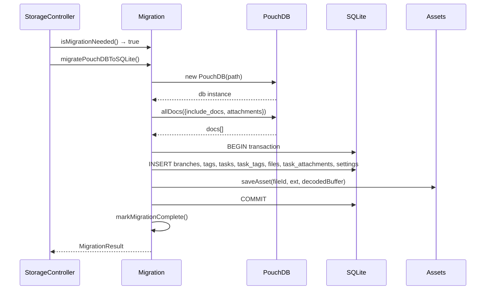

# Phase 04: PouchDB Data Migration

## 1. Goal

Implement a one-time PouchDB-to-SQLite data migration that runs automatically on first launch after update. Existing user data (tasks, tags, branches, files, settings, and their associations) is migrated to SQLite. PouchDB data is kept intact for rollback safety. After this phase, existing users seamlessly transition to SQLite on upgrade.

## 2. Context

### Current State Analysis

PouchDB stores all data in `~/Library/Application Support/Daily/db/` as LevelDB files. Documents use type-prefixed IDs (`task:abc`, `tag:xyz`, `branch:main`, `settings:default`, `file:def`). File binary data is stored as base64 in `_attachments.data`. Permanently deleted documents use `deletedAt = '1970-01-01T00:00:00.000Z'` (epoch sentinel).

After Phase 3, the app runs on SQLite. New installs start with an empty SQLite DB. But existing users have data in PouchDB that needs to be migrated.

**PouchDB document structure (from research):**

- `TaskDoc`: `_id: "task:{id}"`, `type: "task"`, `status`, `content`, `scheduled: {date, time, timezone}`, `orderIndex`, `estimatedTime`, `spentTime`, `branchId`, `minimized`, `tags: string[]`, `attachments: string[]`, `createdAt`, `updatedAt`, `deletedAt`
- `TagDoc`: `_id: "tag:{id}"`, `type: "tag"`, `name`, `color`, `createdAt`, `updatedAt`, `deletedAt`
- `BranchDoc`: `_id: "branch:{id}"`, `type: "branch"`, `name`, `createdAt`, `updatedAt`, `deletedAt`
- `FileDoc`: `_id: "file:{id}"`, `type: "file"`, `name`, `mimeType`, `size`, `_attachments.data.data` (base64), `createdAt`, `updatedAt`, `deletedAt`
- `SettingsDoc`: `_id: "settings:default"`, `type: "settings"`, `data: Settings`, `createdAt`, `updatedAt`

### Architecture Context

**ADR-8:** One-time PouchDB→SQLite migration with rollback safety. Detect PouchDB data on first launch, migrate in SQLite transaction, keep PouchDB intact. `.migrated` flag only written on success. Retry on next launch if failed.

### Data Flow Steps (from design/02-data-flow.md, sections 1 + 10)

Success path:

```
6. Check isMigrationNeeded(pouchdbPath, db)
   6a. PouchDB dir exists? + SQLite tasks table empty? + no .migrated flag?
   6b. If yes → migratePouchDBToSQLite(pouchdbPath, db, assetsDir)
       - Open PouchDB, allDocs with attachments
       - BEGIN transaction
       - Insert branches, tags, tasks, task_tags, files, task_attachments, settings
       - Extract base64 file data → write to assets/
       - COMMIT
       - markMigrationComplete(dbDir, result)
```

Error path:

```
6. isMigrationNeeded returns true but migratePouchDBToSQLite fails
   6a. PouchDB can't open → MigrationResult.success = false, warnings logged
   6b. SQLite transaction rolled back → DB remains empty
   6c. App logs error, continues with empty DB (user data preserved in PouchDB)
   6d. Next launch will retry migration
```

### Sequence Excerpt (from design/03-sequence.md, section 5)



### Key Discoveries

- `_mappers.ts:13-34` — ID prefix stripping: `task:abc` → `abc` using `id.split(":")[1]`
- `_mappers.ts:43` — `orderIndex` fallback to `Date.parse(createdAt)` if not finite
- `_mappers.ts:58` — `branchId` defaults to `MAIN_BRANCH_ID` if missing
- `_mappers.ts:59` — `minimized` defaults to `false` if missing
- `_mappers.ts:61` — `attachments` defaults to `[]` if missing
- `TaskModel.ts:176` — Permanent delete threshold: `new Date("2000-01-01").getTime()`
- `TaskModel.ts:241` — Epoch sentinel: `new Date(0).toISOString()` = `"1970-01-01T00:00:00.000Z"`
- `fileToDoc` (lines 233-249) — base64 encode in `_attachments.data.data`
- PouchDB `allDocs` with `{attachments: true, binary: false}` returns base64 strings
- Documents with `_deleted: true` should be skipped entirely
- `branchId` may be missing on old tasks (pre-branch feature) — default to `'main'`

### Desired End State

- `src/main/storage/database/scripts/pouchdb-to-sqlite.ts` exists with `migratePouchDBToSQLite`, `isMigrationNeeded`, `markMigrationComplete`
- `StorageController.init()` calls migration check after `initDatabase()` but before model instantiation
- Existing PouchDB users: migration runs transparently, all data appears in SQLite
- Migration is atomic (single SQLite transaction for structured data)
- File binaries decoded from base64 and written to `assets/{id}.{ext}`
- `.migrated` JSON flag file created in db directory on success
- PouchDB directory left intact (not deleted)
- Failed migrations retry on next launch
- App works normally regardless of migration success/failure

## 3. Files to Create or Modify

| File                                                     | Action | Why                                |
| -------------------------------------------------------- | ------ | ---------------------------------- |
| `src/main/storage/database/scripts/pouchdb-to-sqlite.ts` | create | One-time data migration logic      |
| `src/main/storage/StorageController.ts`                  | modify | Add migration check to init() flow |

## 4. Implementation Approach

1. **Create migration module**
   - What to do: Create `src/main/storage/database/scripts/pouchdb-to-sqlite.ts` with three exports:

   **`isMigrationNeeded(pouchdbPath, sqliteDb)`:**
   - Check if PouchDB directory exists (`fs.existsSync(pouchdbPath)`)
   - Derive the db directory from the SQLite instance: `const dbDir = path.dirname(sqliteDb.name)` (`better-sqlite3`'s `Database.name` property returns the file path)
   - Check if `.migrated` flag file does NOT exist: `!fs.existsSync(path.join(dbDir, '.migrated'))`
   - Check if SQLite `tasks` table is empty: `sqliteDb.prepare('SELECT COUNT(*) as count FROM tasks').get().count === 0`
   - Return `true` only if all three conditions met

   **`migratePouchDBToSQLite(pouchdbPath, sqliteDb, assetsDir)`:**
   - Import PouchDB dynamically: `const PouchDB = (await import("pouchdb")).default` (dynamic import keeps it optional — Phase 7 removes the package)
   - Open PouchDB: `new PouchDB(pouchdbPath)`
   - `allDocs({include_docs: true, attachments: true, binary: false})` — gets all docs with base64 attachments
   - Skip `_deleted` documents
   - Categorize by `doc.type`: tasks, tags, branches, files, settings
   - Strip ID prefixes using `id.split(":")[1]`
   - Skip permanently deleted docs (`deletedAt` before year 2000 — epoch sentinel)
   - Build insert statements inside a single SQLite transaction:
     - **Branches first** (FK target): `INSERT OR IGNORE INTO branches` — strip `branch:` prefix, map fields
     - Ensure `main` branch exists (may already be seeded by v001 migration)
     - **Tags**: `INSERT OR IGNORE INTO tags` — strip `tag:` prefix, map fields. No `sort_order` column.
     - **Tasks**: `INSERT OR IGNORE INTO tasks` — strip `task:` prefix, flatten `scheduled.{date,time,timezone}` → three columns, convert `minimized` boolean → 0/1, default `branchId` to `'main'`
     - **task_tags**: for each task, iterate `task.tags[]` → `INSERT OR IGNORE INTO task_tags (task_id, tag_id)`
     - **Files**: `INSERT OR IGNORE INTO files` — strip `file:` prefix, map `mimeType` → `mime_type`. Extract base64 from `_attachments.data.data` → `Buffer.from(base64, 'base64')` → write to `assets/{fileId}.{ext}` where ext is `path.extname(file.name).slice(1)` (e.g., `photo.jpeg` → `jpeg`). If write fails, log warning and skip.
     - **task_attachments**: for each task, iterate `task.attachments[]` → `INSERT OR IGNORE INTO task_attachments (task_id, file_id)` — only insert if file_id exists in files table
     - **Settings**: if settings doc exists, `INSERT OR REPLACE INTO settings` — `id='default'`, `version` from `settingsDoc.data.version` (or generate `nanoid()` if missing), `data=JSON.stringify(settingsDoc.data)`, timestamps from `settingsDoc.createdAt`/`settingsDoc.updatedAt`
   - COMMIT transaction
   - Close PouchDB: `await pouchDB.close()`
   - Return `MigrationResult` with counts and warnings

   **`markMigrationComplete(dbDir, result)`:**
   - Write `{migratedAt, result}` to `path.join(dbDir, '.migrated')` as JSON

   - Acceptance check: `pnpm typecheck:main` passes. Handles missing fields gracefully with defaults. Uses `INSERT OR IGNORE` to tolerate duplicate/bad data.

2. **Integrate migration into StorageController.init()**
   - What to do: In `src/main/storage/StorageController.ts`, locate the `init()` method. After the `initDatabase(fsPaths.dbPath())` call (added in Phase 3) and before model instantiation (the `new TaskModel(db)` etc. lines), insert:

     ```typescript
     import {isMigrationNeeded, markMigrationComplete, migratePouchDBToSQLite} from "@/storage/database/scripts/pouchdb-to-sqlite"

     // Inside init(), after initDatabase and before model instantiation:
     const pouchdbPath = fsPaths.oldDbPath() // defined in Phase 01: ~/Library/Application Support/Daily/db
     if (isMigrationNeeded(pouchdbPath, db)) {
       try {
         const result = await migratePouchDBToSQLite(pouchdbPath, db, fsPaths.assetsDir())
         const dbDir = path.dirname(fsPaths.dbPath())
         await markMigrationComplete(dbDir, result)
         logger.info("Migration completed", result)
       } catch (error) {
         logger.error("Migration failed, will retry next launch", error)
       }
     }
     ```

     Note: `fsPaths.oldDbPath()`, `fsPaths.dbPath()`, and `fsPaths.assetsDir()` were added to `config.ts` in Phase 01.

   - Acceptance check: Migration runs on first launch with PouchDB data. Skips on subsequent launches. App works even if migration fails.

## 5. Embedded Contracts

### Migration Contract (from design/04-contracts.md section 2.6)

```typescript
import type Database from "better-sqlite3"

type MigrationResult = {
  success: boolean
  counts: {
    tasks: number
    tags: number
    branches: number
    files: number
    settings: boolean
    taskTags: number
    taskAttachments: number
    fileAssets: number
  }
  warnings: string[]
  durationMs: number
}

/**
 * One-time migration. Algorithm:
 * 1. Open PouchDB, allDocs with attachments
 * 2. Categorize by type, strip _id prefixes, strip _rev
 * 3. Skip permanently deleted (deletedAt = epoch)
 * 4. Map fields to SQL columns (flatten scheduled, convert boolean→int)
 * 5. Extract base64 file data → disk
 * 6. All SQL in single transaction
 */
export function migratePouchDBToSQLite(pouchdbPath: string, sqliteDb: Database.Database, assetsDir: string): Promise<MigrationResult>

/** Check if migration needed: PouchDB exists + SQLite empty + no flag. */
export function isMigrationNeeded(pouchdbPath: string, sqliteDb: Database.Database): boolean

/** Write .migrated flag file. */
export function markMigrationComplete(dbDir: string, result: MigrationResult): Promise<void>
```

### Field Mapping Reference

| PouchDB Field            | SQLite Column           | Transformation                                  |
| ------------------------ | ----------------------- | ----------------------------------------------- |
| `_id`                    | `id`                    | Strip type prefix: `"task:abc"` → `"abc"`       |
| `_rev`                   | —                       | Discarded                                       |
| `type`                   | —                       | Determines target table                         |
| `scheduled.date`         | `scheduled_date`        | Direct copy                                     |
| `scheduled.time`         | `scheduled_time`        | Direct copy                                     |
| `scheduled.timezone`     | `scheduled_timezone`    | Direct copy                                     |
| `orderIndex`             | `order_index`           | Fallback: `Date.parse(createdAt)` if not finite |
| `branchId`               | `branch_id`             | Default to `'main'` if missing                  |
| `minimized`              | `minimized`             | `Boolean` → `0 \| 1`                            |
| `tags: string[]`         | `task_tags` rows        | One INSERT per tag ID                           |
| `attachments: string[]`  | `task_attachments` rows | One INSERT per file ID                          |
| `_attachments.data.data` | `assets/{id}.{ext}`     | Base64 decode → file on disk                    |
| `settings.data`          | `settings.data`         | `JSON.stringify()`                              |
| `estimatedTime`          | `estimated_time`        | Direct copy                                     |
| `spentTime`              | `spent_time`            | Direct copy                                     |
| `createdAt`              | `created_at`            | Direct copy                                     |
| `updatedAt`              | `updated_at`            | Direct copy                                     |
| `deletedAt`              | `deleted_at`            | Direct copy (null or ISO string)                |

## 6. Validation Gates

### Automated

- [ ] `pnpm lint` passes
- [ ] `pnpm typecheck:main` passes
- [ ] `grep -r "pouchdb-to-sqlite" src/main/storage/StorageController.ts` returns a match (migration is wired in)

### Manual

- [ ] With existing PouchDB data (from previous app version), launch new version — all tasks and tags appear in the UI
- [ ] Files attached in PouchDB version are accessible via `daily://file/{id}` after migration
- [ ] Settings (theme, sidebar state, branch) preserved after migration
- [ ] Check `~/Library/Application Support/Daily/db/.migrated` file exists with JSON content
- [ ] Re-launch app — migration does NOT re-run (`.migrated` flag prevents it)
- [ ] Delete `.migrated` flag → migration re-runs on next launch (idempotent via INSERT OR IGNORE)
- [ ] `isMigrationNeeded` returns `false` when PouchDB directory doesn't exist (new install)

## Scope Boundary

This phase does NOT:

- Modify any model, service, or controller code (done in Phases 2-3)
- Rewrite sync system (Phase 5)
- Delete PouchDB files or dependencies (Phase 7)
- Show migration progress UI (per design open questions — no migration UX needed)

## 7. Implementation Note

After completing this phase and all automated verification passes, pause here for manual confirmation from the human that the manual testing was successful before proceeding to the next phase.
