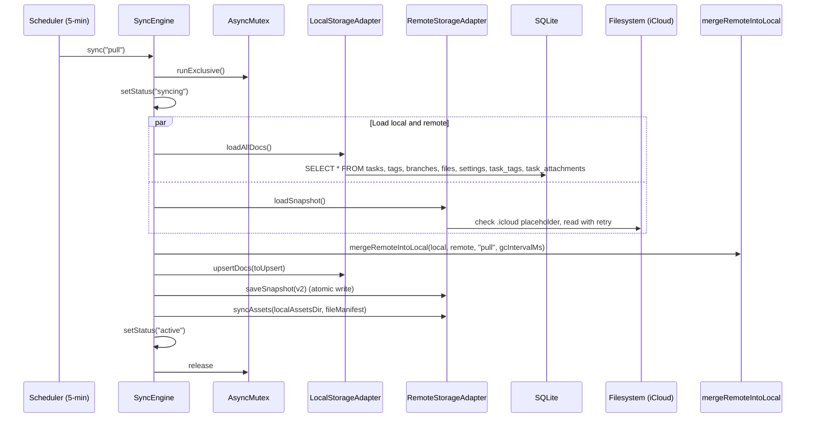

# Phase 05: Sync System Adaptation

## 1. Goal

Rewrite the iCloud sync system to work with SQLite: new LocalStorageAdapter using SQL queries, fixed RemoteStorageAdapter with atomic writes/retry/.icloud handling, AsyncMutex on SyncEngine, Snapshot v2 format (no binary data), backward-compatible v1 reading, incremental file asset sync, and unified settings merge tie-break. After this phase, iCloud sync works fully with SQLite.

## 2. Context

### Current State Analysis

The sync system has four main components:

1. **SyncEngine** (`src/main/storage/sync/SyncEngine.ts`) — orchestrates sync cycles, no mutex on `_sync()`
2. **LocalStorageAdapter** (`src/main/storage/sync/adapters/LocalStorageAdapter.ts`) — reads/writes PouchDB via `allDocs`/`bulkDocs` with `withRetryOnConflict`
3. **RemoteStorageAdapter** (`src/main/storage/sync/adapters/RemoteStorageAdapter.ts`) — reads/writes `snapshot.json` via raw `fs.readFile`/`fs.writeFile` with no atomic write, no retry, no `.icloud` handling
4. **Merge utilities** (`src/main/utils/sync/merge/`) — LWW merge keyed by `_id`, settings tie-break favors local
5. **Snapshot utilities** (`src/main/utils/sync/snapshot/`) — hash computation strips `_attachments`, sorts by `_id`

**Key issues being fixed (from design):**

- No `AsyncMutex` on `_sync()` — manual and scheduled sync can overlap
- Raw `fs.writeFile` — no atomic write (temp+rename)
- No retry on read failures — partial iCloud upload causes corrupt read
- No `.icloud` placeholder handling — evicted files return ENOENT
- Settings merge: local wins tie; should be remote wins on pull
- Snapshot includes base64 file data — makes sync slow with large files

### Architecture Context

**ADR-6:** Snapshot v2 without binary data. Files sync via `sync/assets/`. Backward-compatible v1 reading.

**ADR-7:** AsyncMutex on SyncEngine + atomic writes. Temp-file-plus-rename for snapshot writes.

**From design open questions:** No snapshot version negotiation needed. When new version released, v1 is simply overwritten with v2.

### Data Flow Steps (from design/02-data-flow.md, section 8)

```
1. Scheduler fires (every 5 min) or user triggers forceSync()
2. SyncEngine.sync("pull") → mutex.runExclusive(...)
3. _sync("pull"):
   a. localStore.loadAllDocs() → SQL SELECTs for all tables → SnapshotV2Docs
   b. remoteStore.loadSnapshot() → read snapshot.v2.json (with retry + .icloud check)
   c. If remote is v1: convertV1ToV2(remoteDocs) ← strips prefixes, extracts attachments
   d. Compare hashes → if equal, return early
   e. mergeRemoteIntoLocal(localDocs, remoteDocs, "pull", gcIntervalMs)
   f. If changes: localStore.upsertDocs(mergedDocs) → INSERT OR REPLACE in transaction
   g. If changes: localStore.deleteDocs(toRemove) → DELETE in transaction
   h. If changes: onDataChanged() → broadcast to renderer
   i. Compare result hash vs remote hash
   j. If push needed: buildSnapshot(resultDocs) → remoteStore.saveSnapshot(v2)
   k. remoteStore.syncAssets(localAssetsDir, fileManifest)
```

### Sequence Excerpt (from design/03-sequence.md, section 3)



### Key Discoveries

- `SyncEngine.ts` — `_sync()` has no mutex guard (manual forceSync + scheduled sync can overlap)
- `RemoteStorageAdapter.ts` — `loadSnapshot()` uses `fs.readFile` → `JSON.parse` with no retry
- `RemoteStorageAdapter.ts` — `saveSnapshot()` uses `fs.writeFile` directly (not atomic)
- `mergeCollections.ts` — keyed by `_id` (PouchDB doc IDs with prefixes) — must change to `id`
- `mergeSettings.ts` — uses `isNewerOrEqual(local, remote)` without strategy parameter — local always wins tie
- `buildSnapshot.ts` — strips `_attachments` before hashing, sorts by `_id`
- `isValidSnapshot.ts` — validates v1 format only
- `LocalStorageAdapter.ts` — uses `db.allDocs` + `db.bulkDocs` with `withRetryOnConflict`
- Current snapshot file: `snapshot.json` — new file: `snapshot.v2.json`
- Current snapshot has no `version` field
- Sync types in `src/main/types/sync.ts` define `Snapshot`, `SnapshotDocs`, `SnapshotMeta`, `SyncDoc`, `ILocalStorage`, `IRemoteStorage`

### Desired End State

- SyncEngine wraps `_sync()` in AsyncMutex
- LocalStorageAdapter reads/writes SQLite directly (no PouchDB, no retry)
- RemoteStorageAdapter: atomic write (temp+rename), retry with backoff (3x), `.icloud` stub detection
- Snapshot v2 format: `{version: 2, docs: SnapshotV2Docs, meta: SnapshotMeta}` — no binary data
- V1 snapshots read and converted to v2 on import
- Merge logic works with v2 types (keyed by `id`, not `_id`)
- mergeSettings accepts `strategy` parameter, remote wins tie on pull
- Asset sync: copy files between `assets/` and `sync/assets/`
- All sync-related types updated in `src/main/types/sync.ts`
- iCloud sync works end-to-end between SQLite devices

## 3. Files to Create or Modify

| File                                                     | Action  | Why                                                                   |
| -------------------------------------------------------- | ------- | --------------------------------------------------------------------- |
| `src/main/types/sync.ts`                                 | rewrite | SnapshotV2 types, v1 backward compat types                            |
| `src/main/storage/sync/SyncEngine.ts`                    | modify  | Add AsyncMutex, v1→v2 conversion, asset sync                          |
| `src/main/storage/sync/adapters/LocalStorageAdapter.ts`  | rewrite | SQL read/write instead of PouchDB                                     |
| `src/main/storage/sync/adapters/RemoteStorageAdapter.ts` | rewrite | Atomic write, retry, .icloud handling, asset sync                     |
| `src/main/utils/sync/merge/mergeRemoteIntoLocal.ts`      | modify  | SnapshotV2Docs, typed upsert/delete, pass strategy to mergeSettings   |
| `src/main/utils/sync/merge/mergeCollections.ts`          | modify  | Key by `id` instead of `_id`, use `updated_at` instead of `updatedAt` |
| `src/main/utils/sync/merge/mergeSettings.ts`             | modify  | Accept strategy param, remote wins tie on pull                        |
| `src/main/utils/sync/snapshot/buildSnapshot.ts`          | modify  | V2 format, hash by `id`                                               |
| `src/main/utils/sync/snapshot/isValidSnapshot.ts`        | modify  | Validate both v1 and v2                                               |
| `src/main/config.ts`                                     | modify  | Update `remoteSyncPath` snapshot filename to `snapshot.v2.json`       |

## 4. Implementation Approach

1. **Update sync types**
   - What to do: Rewrite `src/main/types/sync.ts`. Delete existing exports: `SyncDoc`, `SnapshotDocs`, `Snapshot`, `ILocalStorage`, `IRemoteStorage`. Keep and update: `SnapshotMeta`, `SyncStrategy`. Add new: `SnapshotV2`, `SnapshotV2Docs`, `SnapshotTask`, `SnapshotTag`, `SnapshotBranch`, `SnapshotFile`, `SnapshotSettings`, `SnapshotV1`, `Snapshot` (union), `MergeResult`, `detectSnapshotVersion`. Update `ILocalStorage` and `IRemoteStorage` interfaces. See full type definitions in Embedded Contracts section below.
   - Acceptance check: All sync types compile. Both v1 and v2 discriminated by `version` field. `pnpm typecheck:main` passes.

2. **Rewrite LocalStorageAdapter**
   - What to do: Rewrite `src/main/storage/sync/adapters/LocalStorageAdapter.ts`. Change constructor from PouchDB to SQLite: `constructor(private db: Database.Database)` with `import type Database from "better-sqlite3"`. Implement:
     - `loadAllDocs()`: SELECT from all tables, build SnapshotV2Docs. For tasks: query task_tags and task_attachments to build `tags: string[]` and `attachments: string[]` arrays per task. For other collections: simple SELECT + map.
     - `upsertDocs(docs: SnapshotV2Docs)`: In a single transaction: INSERT OR REPLACE for each collection (tasks, tags, branches, files, settings). For tasks: DELETE FROM task_tags WHERE task_id = ? first, then INSERT new task_tags rows. Same for task_attachments: DELETE then INSERT.
     - `deleteDocs(ids)`: DELETE by typed IDs in a single transaction.
     - No `withRetryOnConflict` — SQLite has no revision conflicts.
   - Acceptance check: No PouchDB imports. SQL transactions for writes. Returns SnapshotV2Docs. `pnpm typecheck:main` passes.

3. **Rewrite RemoteStorageAdapter**
   - What to do: Rewrite `src/main/storage/sync/adapters/RemoteStorageAdapter.ts`. Constructor receives `syncDir: string` (from `fsPaths.remoteSyncPath()`, which resolves to `~/Library/Mobile Documents/com~apple~CloudDocs/Daily`). Implement:
     - `loadSnapshot()`: Check for `.icloud` placeholder (`.<filename>.icloud`). Read `path.join(syncDir, 'snapshot.v2.json')` with retry (3 attempts, exponential backoff: 500ms, 1s, 2s). Parse JSON, validate via `isValidSnapshot`, detect version via `detectSnapshotVersion`. Return `Snapshot | null`.
     - `saveSnapshot(v2)`: Write to `path.join(syncDir, 'snapshot.v2.json.tmp')` then `fs.rename` to `path.join(syncDir, 'snapshot.v2.json')` (atomic on APFS).
     - `syncAssets(localAssetsDir, fileManifest)`: The sync assets directory is `path.join(syncDir, 'assets')`. Copy files between `localAssetsDir` (from `fsPaths.assetsDir()`) and `path.join(syncDir, 'assets')` bidirectionally. Only copy files that exist in manifest. Conflict resolution: skip copy if file already exists at destination (no content comparison — presence check only). `fs.ensureDir` the sync assets dir. Log warnings for individual file failures, don't abort.
   - Acceptance check: Atomic write uses temp+rename pattern. Retry with exponential backoff. `.icloud` stub detection.

4. **Add AsyncMutex to SyncEngine**
   - What to do: In `src/main/storage/sync/SyncEngine.ts`, add `private mutex = new AsyncMutex()` using the existing `AsyncMutex` class from `@/utils/AsyncMutex` (already used in the codebase at `src/main/utils/AsyncMutex.ts` — no new dependency needed). Wrap the body of `sync()` in `this.mutex.runExclusive(async () => { ... })`. Add v1→v2 conversion: if `detectSnapshotVersion(remoteSnapshot)` returns 1, call `convertV1ToV2(snapshot)` which:
     - For each doc type: strip `_id` prefix (`task:abc` → `abc`, `tag:xyz` → `xyz`, `branch:main` → `main`, `file:def` → `def`) using `id.split(":")[1]`
     - Tasks: map `tags: string[]` (tag names in v1) to tag IDs by looking up `remoteDocs.tags` by name; map `attachments: string[]` directly (already file IDs); flatten `scheduled.{date,time,timezone}` → `scheduled_date/time/timezone`; map camelCase → snake_case (`updatedAt` → `updated_at`, `deletedAt` → `deleted_at`, etc.)
     - Discard `_rev`, `_attachments`, `type` fields from all docs
     - Set `version: 2` on output
       Add `remoteStore.syncAssets()` call after push.
   - Acceptance check: Concurrent sync calls are serialized. V1 snapshots converted correctly.

5. **Update merge utilities**
   - What to do:
     - `mergeCollections`: change key from `doc._id` to `doc.id`, change `updatedAt` to `updated_at`, change `deletedAt` to `deleted_at`
     - `mergeSettings`: add `strategy: SyncStrategy` parameter. On tie: `"pull"` → remote wins, `"push"` → local wins
     - `mergeRemoteIntoLocal`: accept SnapshotV2Docs, return typed MergeResult. Pass `strategy` to `mergeSettings`.
   - Acceptance check: Settings tie-break changes with strategy. Collections keyed by `id`.

6. **Update snapshot filename in RemoteStorageAdapter**
   - What to do: There is no config-level constant for the snapshot filename — it is hardcoded in `RemoteStorageAdapter`. In Step 3 above, the filename `snapshot.v2.json` is already hardcoded in the rewritten `loadSnapshot()` and `saveSnapshot()` methods. No change to `config.ts` needed for the filename. Remove `src/main/config.ts` from the files table if no other changes are needed there.
   - Acceptance check: `grep "snapshot.v2.json" src/main/storage/sync/adapters/RemoteStorageAdapter.ts` returns a match.

7. **Update snapshot utilities**
   - What to do:
     - `buildSnapshot`: produce SnapshotV2 with `version: 2`. Hash sorts by `id` (not `_id`). No `_attachments` stripping needed.
     - `isValidSnapshot`: validate both v1 and v2 formats. V2 requires `version: 2` + `docs` + `meta`.
   - Acceptance check: Built snapshot has `version: 2`. Validator accepts both formats.

## 5. Embedded Contracts

### Core Sync Types

```typescript
type SyncStrategy = "pull" | "push"

type SnapshotMeta = {
  /** ISO date time when snapshot was last updated */
  updatedAt: string
  /** Combined hash of all document collections */
  hash: string
}

/** Discriminate snapshot version: v1 has no `version` field, v2 has `version: 2` */
function detectSnapshotVersion(snapshot: Snapshot): 1 | 2

type MergeResult = {
  resultDocs: SnapshotV2Docs
  toUpsert: SnapshotV2Docs
  toRemove: {tasks?: string[]; tags?: string[]; branches?: string[]; files?: string[]}
  changes: number
}
```

### Snapshot V2 Types (from design/04-contracts.md section 2.5)

```typescript
type SnapshotV2 = {
  version: 2
  docs: SnapshotV2Docs
  meta: SnapshotMeta
}

type SnapshotV2Docs = {
  tasks: SnapshotTask[]
  tags: SnapshotTag[]
  branches: SnapshotBranch[]
  files: SnapshotFile[]
  settings: SnapshotSettings | null
}

type SnapshotTask = {
  id: string
  status: string
  content: string
  minimized: boolean
  order_index: number
  scheduled_date: string
  scheduled_time: string
  scheduled_timezone: string
  estimated_time: number
  spent_time: number
  branch_id: string
  tags: string[]
  attachments: string[]
  created_at: string
  updated_at: string
  deleted_at: string | null
}

type SnapshotTag = {
  id: string
  name: string
  color: string
  created_at: string
  updated_at: string
  deleted_at: string | null
}

type SnapshotBranch = {
  id: string
  name: string
  created_at: string
  updated_at: string
  deleted_at: string | null
}

type SnapshotFile = {
  id: string
  name: string
  mime_type: string
  size: number
  created_at: string
  updated_at: string
  deleted_at: string | null
}

type SnapshotSettings = {
  id: string
  version: string
  data: string
  created_at: string
  updated_at: string
}

type SnapshotV1 = {
  version?: undefined
  docs: {tasks: any[]; tags: any[]; branches: any[]; files: any[]; settings: any | null}
  meta: SnapshotMeta
}

type Snapshot = SnapshotV1 | SnapshotV2
```

### LocalStorageAdapter (from design/04-contracts.md section 3.1)

```typescript
interface ILocalStorage {
  loadAllDocs(): Promise<SnapshotV2Docs>
  upsertDocs(docs: SnapshotV2Docs): Promise<void>
  deleteDocs(ids: {tasks?: string[]; tags?: string[]; branches?: string[]; files?: string[]}): Promise<void>
}
```

### RemoteStorageAdapter (from design/04-contracts.md section 3.2)

```typescript
interface IRemoteStorage {
  loadSnapshot(): Promise<Snapshot | null>
  saveSnapshot(snapshot: SnapshotV2): Promise<void>
  syncAssets(localAssetsDir: string, fileManifest: SnapshotFile[]): Promise<void>
}
```

### mergeSettings (from design/04-contracts.md section 3.4)

```typescript
function mergeSettings(local: SnapshotSettings | null, remote: SnapshotSettings | null, strategy: SyncStrategy): SnapshotSettings | null
```

### buildSnapshot (from design/04-contracts.md)

```typescript
function buildSnapshot(docs: SnapshotV2Docs): SnapshotV2
// Produces { version: 2, docs, meta: { updatedAt: now, hash: computeHash(docs) } }
// Hash: sort each collection by `id`, JSON.stringify, SHA-256 hex

function buildSnapshotMeta(docs: SnapshotV2Docs): SnapshotMeta
// Returns { updatedAt: now, hash: computeHash(docs) }
```

### mergeRemoteIntoLocal (from design/04-contracts.md)

```typescript
function mergeRemoteIntoLocal(localDocs: SnapshotV2Docs, remoteDocs: SnapshotV2Docs, strategy: SyncStrategy, gcIntervalMs: number): MergeResult
// where MergeResult = {
//   resultDocs: SnapshotV2Docs
//   toUpsert: SnapshotV2Docs
//   toRemove: { tasks?: string[]; tags?: string[]; branches?: string[]; files?: string[] }
//   changes: number
// }
```

### mergeCollections (from design/04-contracts.md section 3.6)

```typescript
function mergeCollections<T extends {id: string; updated_at: string; deleted_at: string | null}>(
  localDocs: T[],
  remoteDocs: T[],
  strategy: SyncStrategy,
  gcIntervalMs: number,
): {result: T[]; toUpsert: T[]; toRemove: string[]}
```

## 6. Validation Gates

### Automated

- [ ] `pnpm lint` passes
- [ ] `pnpm typecheck:main` passes
- [ ] `grep -r "withRetryOnConflict" src/main/storage/sync/` returns no results
- [ ] `grep -r "PouchDB\|pouchdb" src/main/storage/sync/` returns no results
- [ ] `grep "AsyncMutex" src/main/storage/sync/SyncEngine.ts` returns a match
- [ ] `grep "\.tmp" src/main/storage/sync/adapters/RemoteStorageAdapter.ts` returns a match (temp+rename)
- [ ] `grep "strategy" src/main/utils/sync/merge/mergeSettings.ts` returns a match
- [ ] `grep "version: 2" src/main/utils/sync/snapshot/buildSnapshot.ts` returns a match
- [ ] `grep "snapshot.v2.json" src/main/storage/sync/adapters/RemoteStorageAdapter.ts` returns a match

### Manual

- [ ] Enable iCloud sync → status shows "active"
- [ ] Force sync → `snapshot.v2.json` created in iCloud Drive/Daily/
- [ ] Manually corrupt `snapshot.v2.json` → app retries and recovers
- [ ] Two synced instances: create task on one → appears on other after sync
- [ ] Settings change on one device → syncs to other (remote wins tie on pull)
- [ ] File attachments sync via `sync/assets/` directory

## Scope Boundary

This phase does NOT:

- Implement NSFileCoordinator native binding (Phase 6)
- Remove PouchDB dependencies or files (Phase 7)
- Change any model or IPC code

## 7. Implementation Note

After completing this phase and all automated verification passes, pause here for manual confirmation from the human that the manual testing was successful before proceeding to the next phase.
