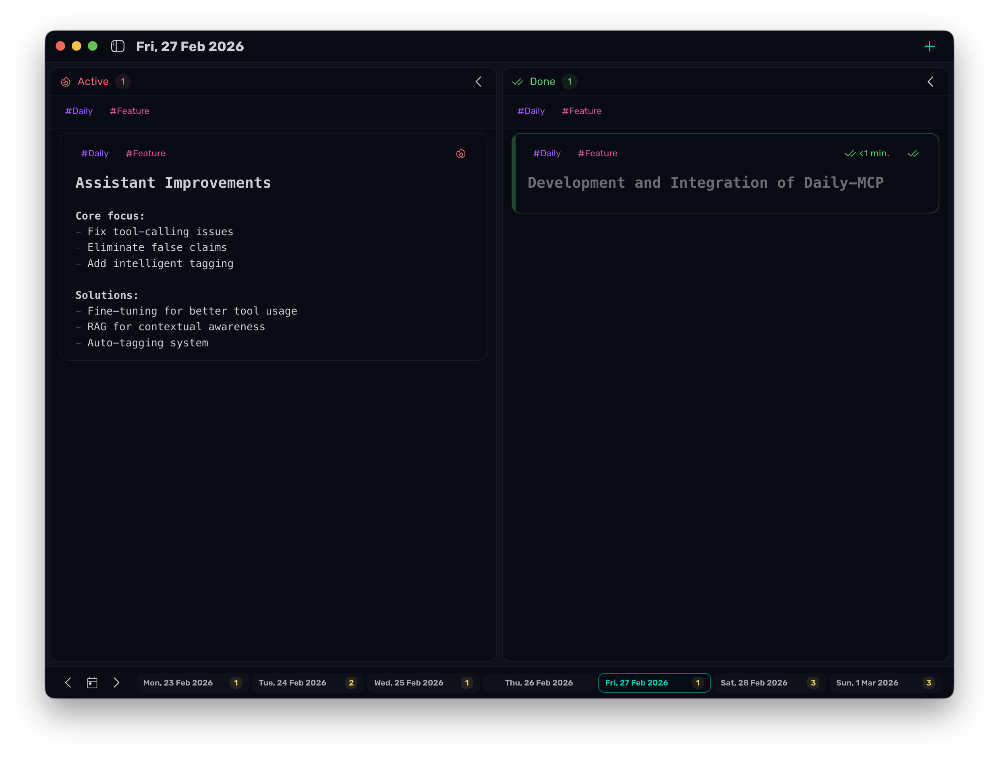
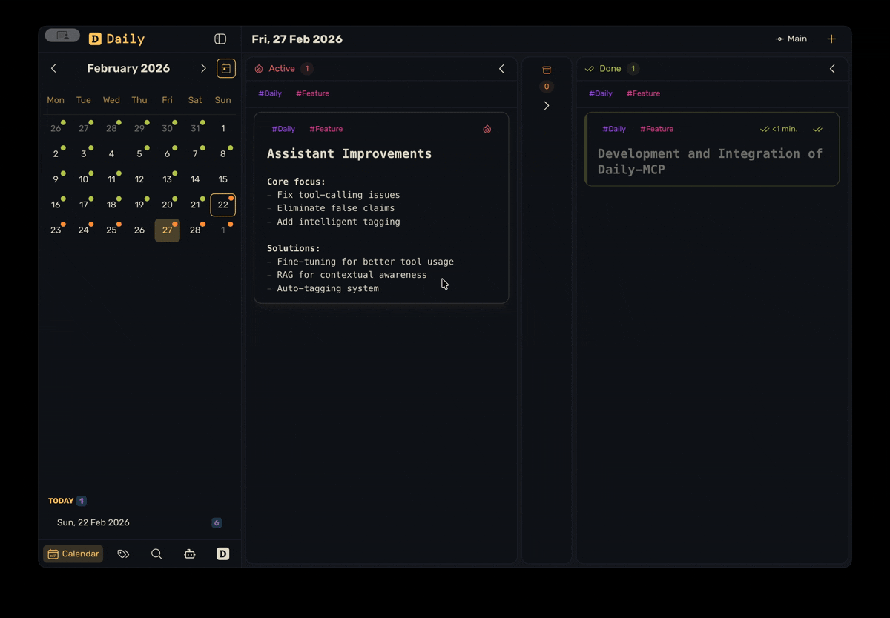
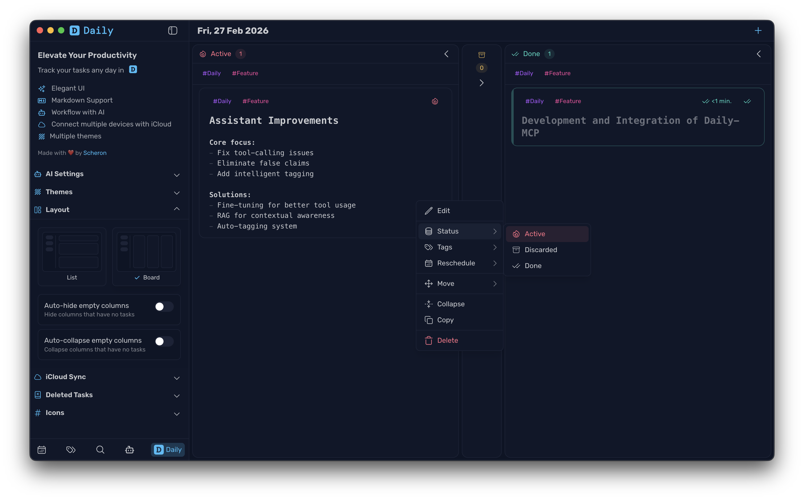
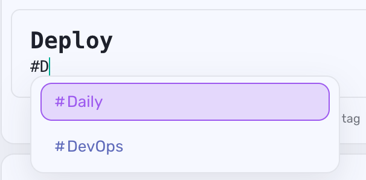
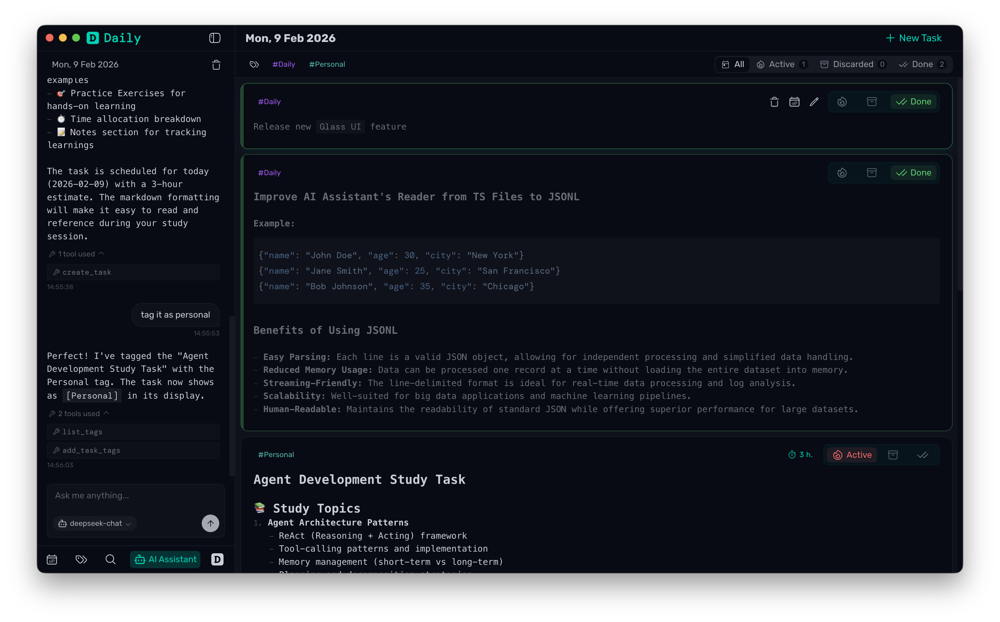
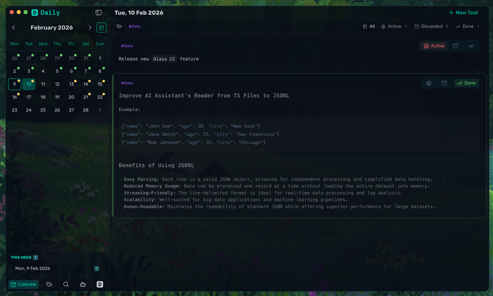
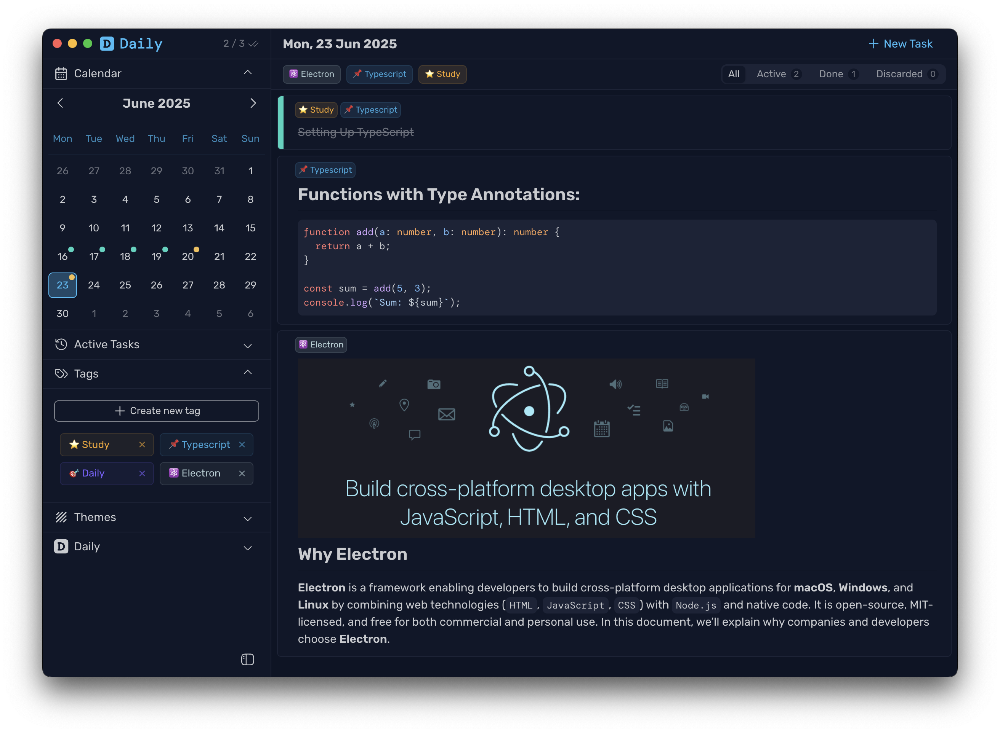
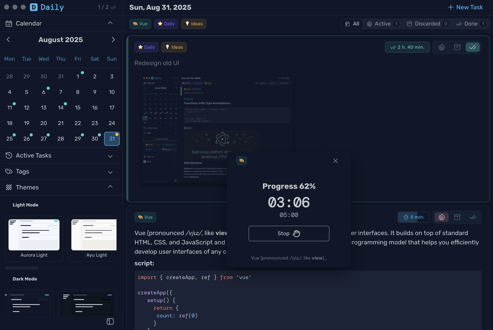

# Changelog

## [Unreleased]

## v0.12.0 - 2026-02-22

### ✨ New Features

- **Compact Mode Footer Navigation** — Introduce new compact navigation UI mode
  

- **Projects / Branches Workflow** — Added Git-like project branches for task isolation
  - Added dedicated `Settings -> Project Management` section for create/rename/delete flows
  - Added move-task-to-project action in task context menu
  - Search now shows project for each result and switches to the target branch before navigation

### 🎨 UI/UX Improvements

- Image preview modal for task content images
- Task context menu now has separate actions: `Copy ID` and `Copy Task`.
- Added `Delete All` in `Settings -> Deleted Tasks` with confirmation.

## v0.11.0 - 2026-02-21

This release focuses on faster task organization, clearer layouts, and smoother day-to-day planning.

### ✨ New Features

- **Flexible Task Layouts** — Switch between `List` and `Board` layouts
  - Keep empty board columns hidden or collapsed
  - In board view, tasks move between columns automatically when status changes

- **Drag-and-Drop Task Management** — Move tasks across board columns
  - Reorder tasks in list view
  - Reorder tasks within columns in board view

- **Task Context Menu** — Faster access to common actions

- **Inline Tag Commands in Editor** — Manage tags while you type
  - Type `#tag` to attach a tag and `-#tag` to detach
  - Use autocomplete suggestions for faster selection

### 🎨 UI/UX Improvements

- **Refined Layout & Tags Settings** — Easier control over workspace behavior
  - New settings section with layout previews
  - Improved tag controls and clearer tag display
  - Extended tag name limit for better naming flexibility

- **Smoother Month Navigation** — Navigate calendar months with wheel or horizontal swipe gestures

- **Expanded Global Shortcuts** — Faster workspace navigation and actions

### 🐛 Bug Fixes

- Fixed an issue where task editor content could shrink while editing in scrollable board columns.
- Fixed incorrect relative date labels for `Today` and `Yesterday`.
- Fixed inconsistent tag ordering.
- Fixed an issue where the current day was not highlighted in the Quick Actions date picker.

## v0.10.0 - 2026-02-09

### ✨ New Features

- **AI Assistant** — Built-in AI chat assistant accessible from the sidebar
  - Chat with AI asistant
  - AI can create, update, complete, and manage tasks
  - Configurable OpenAI API key and model selection in settings

- **Glass UI Theme** — New theme with semi-transparent background
  - Glass UI theme with semi-transparent background for modern aesthetic
  - Can be applied simultaneously with other themes for layered visual effects

- **Deleted Tasks Management** — Enhanced control over recently deleted tasks
  - Restore deleted tasks to their original dates
  - Permanently delete tasks with confirmation
  - Manage all recently deleted tasks from dedicated interface

---

## v0.9.0 - 2026-01-25

### ✨ New Features

- **In-Place Task Editor** - Redesigned task editing experience with inline editing
  - TaskEditorCard component replaces modal editor for seamless editing workflow
  - Edit tasks directly in the task list without opening separate windows
  - Real-time content editing with CodeMirror integration
  - Support for creating new tasks with placeholder in task list
  - Keyboard shortcuts: `Cmd/Ctrl+Enter` to save and close, `Cmd/Ctrl+Shift+Enter` to save and continue
  - Automatic focus management for better editing flow

- **Deleted Tasks Management** - Complete system for managing deleted tasks
  - New DeletedTasks module accessible from sidebar
  - View all deleted tasks with full task details and metadata
  - Restore deleted tasks with automatic navigation to restored task's date
  - Permanent deletion with confirmation popup
  - Visual highlighting of restored tasks for easy identification
  - Loading states and empty state handling

- **Calendar Month View** - Enhanced calendar navigation
  - New CalendarMonth component for month-based date selection
  - Integrated with sidebar for improved date navigation
  - Shows task activity indicators on calendar days

- **Confirm Popup Component** - Reusable confirmation dialog
  - ConfirmPopup component with customizable messages and actions
  - Progress fill animation for destructive actions
  - Flexible positioning and styling options
  - Used for permanent task deletion and other critical confirmations

### 🎨 UI/UX Improvements

- **Enhanced Task Editing Experience** - Improved editor workflow and feedback
  - Unsaved changes detection with confirmation dialog on close
  - Initial state tracking to detect content, tags, and time estimation changes
  - Better visual feedback for editing state
  - Improved placeholder instructions for markdown editing
  - Seamless transition between task card and editor views

- **Improved Task Filtering** - Refactored task filtering logic
  - Better integration with tag filtering
  - More efficient filtering performance
  - Cleaner code organization for filter logic

---

## v0.8.0 - 2025-12-04

### ✨ New Features

- **Search** - Search across all tasks with intelligent fuzzy matching
  - Search panel accessible from sidebar (search icon)
  - Fuzzy matching handles typos and partial matches automatically
  - Click any result to navigate directly to that day and automatically scroll to the task
  - Tasks are highlighted when navigated from search results for easy identification
  - Filter search results by task status (all, active, done, discarded)
  - Results sorted by relevance score and recency

---

## v0.7.1 - 2025-12-03

### ✨ New Features

- **CodeMirror Integration** - Complete markdown editor overhaul with advanced editing capabilities
  - WYSIWYG support for visual markdown editing
  - Enhanced markdown support with GFM features

---

## v0.6.3 - 2025-12-02

### 🐛 Bug Fixes

- Fixed an issue where sidebar does not shows menu

---

## v0.6.2 - 2025-12-02

### 🔄 Time Tracking Improvements

- **Redesigned Time Estimation & Tracking** - Changed approach to time estimation and task time tracking
  - Removed timer functionality for automatic time tracking
  - Added manual time addition/subtraction with preset buttons or input field
  - More flexible and precise control over time spent on tasks

---

## v0.6.1 - 2025-12-01

### 🎨 UI/UX Improvements

- **Redesigned Sidebar Navigation** - Replaced accordion panels with bottom menu bar navigation
  - Removed collapsible accordion panels for cleaner, more focused interface
  - New bottom menu bar with icon-based navigation (Calendar, Tags, Cloud Sync, Themes, Help)
  - Active sections display labels with smooth slide animations
  - Combined Calendar and Active Tasks into single section for related features
  - On mobile/tablet, toggle button always in main header for consistency
  - Collapsed sidebar shows minimal week calendar view

- **Simplified Tag System** - Streamlined tag creation and management
  - Removed emoji support from tags for cleaner, more minimal interface
  - All tags now consistently use hash (#) symbol
  - Redesigned tag creation form with inline input and color picker
  - Tag input now includes hash symbol prefix and clear button
  - Added 10 carefully selected colors with no duplicates
  - Tags list and creation form now visible simultaneously

---

## v0.6.0 - 2025-11-30

### ✨ New Features

- **iCloud Synchronization** - Smart sync system for seamless cross-device experience
  - Automatic background synchronization pulls changes from iCloud every 5 minutes
  - Manual push to upload local changes to iCloud when needed
  - Smart sync strategy: automatic pull for downloads, manual push for uploads
  - Real-time sync status with visual indicators (inactive, active, syncing, error)
  - Sync settings persisted across app restarts
  - Minimum 1-second sync duration for better user feedback
  - Local-first architecture: PouchDB remains source of truth
  - Backend initialization only when sync is enabled (privacy-focused)

- **File Attachments System** - Full support for attaching files to tasks
  - CRUD operations for file attachments with PouchDB `_attachments`
  - Custom protocol handler (`daily://file/{id}`) for secure file access
  - File metadata storage with FileModel and FilesService
  - Integrated attachment management directly in tasks

- **Enhanced Tag Management** - Improved tag system with database integration
  - Full CRUD operations for tags through TagModel and TagsService
  - Task-tag associations with normalized storage (tags stored as string references)
  - Tag hydration in service layer for rich domain objects
  - O(1) tag lookup with Map-based caching

- **DB Viewer Tool** - Developer tool for database inspection
  - In-app database viewer accessible via menu
  - IPC integration for document management
  - Real-time view of PouchDB documents and structure

### 🏗️ Architecture Refactoring

- **Storage Layer Redesign** - Multi-layered storage architecture
  - Implemented StorageController facade pattern coordinating all services
  - Created Service Layer (TasksService, TagsService, FilesService, SettingsService)
  - Built Model Layer for direct PouchDB operations (TaskModel, TagModel, FileModel, SettingsModel)
  - Added Mapper Layer for bidirectional transformation between domain models and documents

- **Document Mappers** - Clean separation between domain and storage
  - `taskToDoc()` / `docToTask()` - Task ↔ TaskDoc transformation
  - `tagToDoc()` / `docToTag()` - Tag ↔ TagDoc transformation
  - `settingsToDoc()` / `docToSettings()` - Settings ↔ SettingsDoc transformation
  - `fileToDoc()` / `docToFile()` - File ↔ FileDoc transformation
  - Document ID strategy with type prefixes (task:, tag:, file:, settings:)

- **IPC Reorganization** - Improved IPC handler structure
  - Reorganized IPC setup into logical modules (storage, window, timer, menu, devtools)
  - Better separation of concerns for IPC handlers
  - Updated window handling for better lifecycle management
  - Enhanced storage interaction patterns

### 🔄 Storage & Sync Improvements

- **Sync Engine Architecture** - Robust synchronization system
  - SyncEngine orchestrates pull/push operations between PouchDB and remote storage
  - Snapshot-based sync with metadata comparison for efficient updates
  - LWW (Last Write Wins) merge strategy for conflict resolution
  - Snapshot integrity validation with SHA-256 hashing
  - Auto-sync scheduler with configurable intervals
  - Event broadcasting for real-time UI updates

---

## v0.5.0 - 2025-11-24

### ✨ New Features

- **🚀 New Data Storage System** - Completely redesigned storage architecture
  - Significantly faster loading and saving of tasks
  - Improved performance when working with large amounts of data
  - More reliable data storage
  - Automatic migration of existing data without data loss

- **📎 File Attachments** - Added support for attaching files and images to tasks
  - Drag and drop files directly into the task editor
  - Images are automatically scaled for convenient viewing
  - All attachments are stored locally and available offline

- **🏷️ Enhanced Tag System** - Faster and more convenient tag management
  - Instant search and filtering by tags
  - Improved performance when working with large numbers of tags
  - More stable task-tag associations

### ⚡ Performance Improvements

- **⚙️ Settings Optimization** - Improved application settings management
  - Faster saving and applying of settings changes
  - Improved synchronization of settings between application components

### 🐛 Bug Fixes

- Fixed issue with duplicate file attachments
- Improved sorting of filtered tasks by status
- Fixed Markdown header styles for better readability
- Improved visibility of interface element borders

---

## v0.4.2 - 2025-09-22

### ✨ New Features

- **Calendar Navigation** - Added "Today" button functionality for quick navigation to current date
- **Sidebar Navigation** - Added navigation buttons for previous and next week in minimized sidebar

### 🐛 Bug Fixes

- **Tags Display** - Fixed issue where tags were showing for all daily tasks instead of only filtered tasks
- **Timer Window** - Fixed timer window not closing when main window is closed
- **Styles** - Updated checkbox colors to use accent color variables for better consistency
- **Markdown Elements** - Fixed background color for markdown elements to use muted background variable

### 🏗️ Build Improvements

- **Build Configuration** - Removed Windows and Linux build configurations, focusing on macOS-only support
- **Icon Generation** - Update icon generation script for new macOS Tahoe version

---

## v0.4.1 - 2025-08-31

### 🐛 Bug Fixes

- Fixed color fill not working when holding delete task button

## v0.4.0 - 2025-08-31

### ✨ New Features

- **🎯 Focus Timer** - Introducing a dedicated focus timer window to help user stay concentrated on each tasks
  - Track time spent on individual tasks
  - Visual progress indicators showing completion percentage
  - Separate timer window for distraction-free focus sessions
  - Real-time timer statistics and focus session tracking

- **⏱️ Estimated Time Tracking** - Plan your day better with time estimation features
  - Set estimated time for tasks during creation or editing
  - Visual indicators showing actual vs estimated time
  - TimePicker component for easy time selection
  - Smart duration formatting and display

### 🎨 UI/UX Improvements

- **🎨 Major Interface Redesign**

  | Before                             | After                             |
  | ---------------------------------- | --------------------------------- |
  |  |  |

- **Enhanced Task Cards** - Redesigned task items with better visual hierarchy
  - Better visual indicators for task status
  - Cleaner presentation of time information
  - Enhanced quick actions and status management

- **Restructured Main Interface** - Complete reorganization for better workflow
  - New header component with improved navigation
  - Redesigned toolbar with dedicated edit and filter panels
  - Better content organization and layout structure
  - Improved day picker with calendar integration

- **📱 Interactive Tooltips** - Added tooltip support throughout the interface for better user guidance

---

## v0.3.5 - 2025-08-18

- fix: issue where save&continue not saves tags
- refactor(ui): reorganize components into common directory structure
  feat: add watch on add or delete current robot portfolios for subscribe

## v0.3.6 - 2025-08-25

### ✨ New Features

- **Task Rescheduling** - Tasks are now flexible! Move them to any day you want with the new **Move Task** option in edit mode.

---

## v0.3.5 - 2025-08-17

### 🐛 Bug Fixes

- **Task Editor** - Fixed issue where "Save & Continue" action was resetting previously assigned tags instead of preserving them

### 🏗️ Code Organization

- Improved UI components structure for better maintainability

---

## v0.3.4 - 2025-07-06

### 🎨 UI/UX Improvements

- **Theme flexibility** - Dark themes can now be used with light mode system preferences
- **Task styling** - Removed line-through style for completed tasks for better readability

### 🏗️ Architecture Refactoring

- **Enhanced app lifecycle management** - Consolidated setup functions and improved protocol handling
- Improved CSP (Content Security Policy) setup
- Better protocol handling for deep links and file associations
- Optimized cache utility performance

---

## v0.3.3 - 2025-06-26

### 🏗️ Architecture Refactoring

- **Major storage architecture refactoring** - Complete overhaul of the storage system with new modular architecture
- Streamlined storage migration process with consolidated migration logic
- Enhanced asset and config handling capabilities

### 🔧 Code Organization Improvements

- Reorganized main process structure for better maintainability:
  - Moved core functionality to dedicated `core/` directory
  - Split IPC handlers into logical modules (`core/ipc.ts`)
  - Reorganized menu handlers (`core/menu/`)
  - Improved setup modules (`core/setup/`)
- Updated main entry point architecture for better static file handling
- Consolidated utility functions with new helper modules
- Added caching utilities and improved file handling

### 🧹 Cleanup & Performance

- Removed legacy storage manager implementation
- Eliminated deprecated helper functions and unused code
- Improved development server and build scripts

---

## v0.3.2 - 2025-06-25

### 🔄 Storage Improvements

- Performance improvements with caching system

---

## v0.3.1 - 2025-06-23

### 🔄 Storage Synchronization

- Cross-device storage sync with automatic synchronization
- Performance improvements for large storage operations
- Real-time sync status with loading indicators

---

## v0.3.0 - 2025-06-22

### ✨ Obsidian-like File Storage

- Tasks now stored as individual markdown files with YAML frontmatter
- Organized by date in Documents/Daily/YYYY-MM-DD/ structure
- Local-first approach with cloud sync compatibility
- Assets stored separately in assets/ folder
- Automatic migration from previous storage system

---

## v0.2.1 - 2025-06-16

### Bug Fixes

- Fixed the issue where the app wouldn't apply the system theme on launch

---

## v0.2.0 - 2025-06-14

### First Public Release

🚀 **Daily** — a minimalist, offline-first task manager designed around your daily Markdown notes.

No cloud. No accounts. Just tasks, just days.

#### 📦 Download

| OS       | Installer                                                                                    |
| -------- | -------------------------------------------------------------------------------------------- |
| 🖥 macOS | [Download `.dmg`](https://github.com/scheron/Daily/releases/download/v0.2.0/Daily-0.2.0.dmg) |

> If you see a warning about an unverified developer, [follow the update instructions](https://github.com/scheron/Daily#-updating).

#### ✨ Features

- Organize tasks by day 📅
- Markdown support 📝
- Keyboard-first UX ⌨️
- Tags & multiple themes 🎨
- Dotfiles integration (`~/.config/daily`)
- Local-first & exportable as `.md`

#### 🔄 Updating

Daily doesn’t auto-update. You’re in control.  
Update instructions: [#-updating](https://github.com/scheron/Daily#-updating)

Let Daily help you stay on track — one day at a time. ☀️
