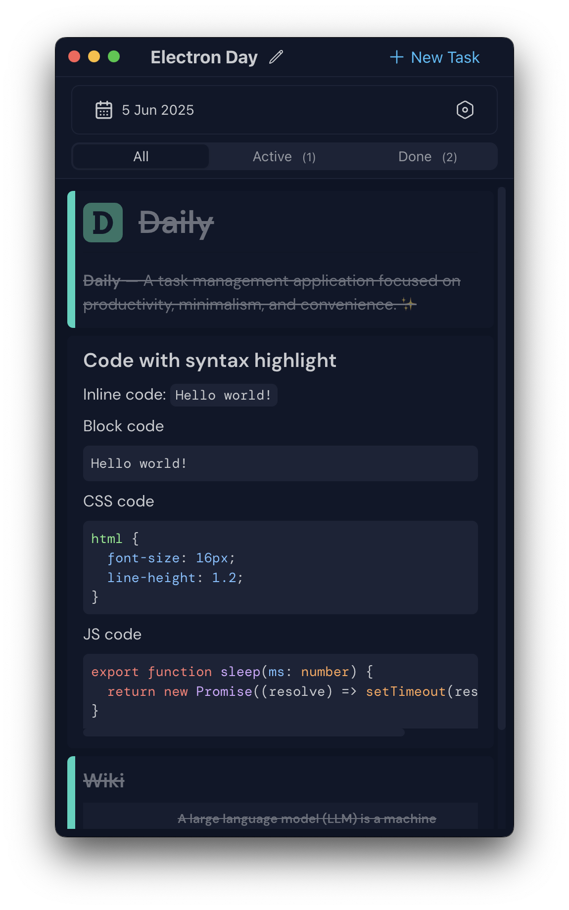

#  Daily 

**Daily** — A task management application focused on productivity, minimalism, and convenience. ✨


| Desktop Version                    | Mobile Version                           |
| ---------------------------------- | ---------------------------------------- |
|  |  |

### Idea 🤔
The whole approach originated from my need to transform my daily task tracking into something more systematic. 

I typically maintain my tasks organized by days, which allows me to revisit and track progress later. 

This stems from the standard workflow requirement: *"What I did yesterday, what I'm doing today"* 📊

```md
## Monday, Dec 16

- [x] Review pull requests  
- [x] Team standup meeting
- [ ] Complete feature implementation

## Tuesday, Dec 17

- [x] Deploy to staging
- [ ] Write documentation
- [ ] Plan next sprint

...
```

I used to manage this in markdown files or Obsidian. Worked great for standups, but needed proper app convenience.

### Daily ✨
- **Day-centric workflow** — tasks organized by date
- **Calendar navigation** 📅 — jump to any day instantly
- **Task management** ✅ — add, edit, complete daily tasks
- **Quick retrospectives** — see yesterday to plan today
- **Markdown support** 📝 — full markdown editing capabilities
- **Keyboard shortcuts** ⌨️ — complete keyboard navigation
- **Multiple themes** 🎨 — 9+ UI themes
- **Dotfiles integration** — syncs to `~/.config/daily`
- **Markdown export** — export tasks in markdown format

## In future 🗺️
- **AI-powered search** 🔍 — to find that task from three weeks ago
- **Smart labels** 🏷️ — to group tasks by project or context
- **Voice-to-task** 🎤 — for when I'm walking and get an idea
