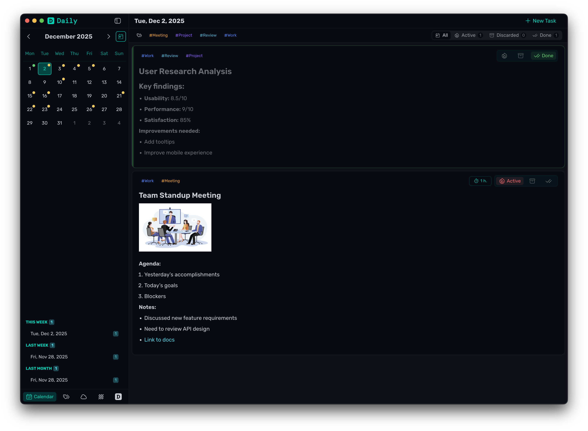
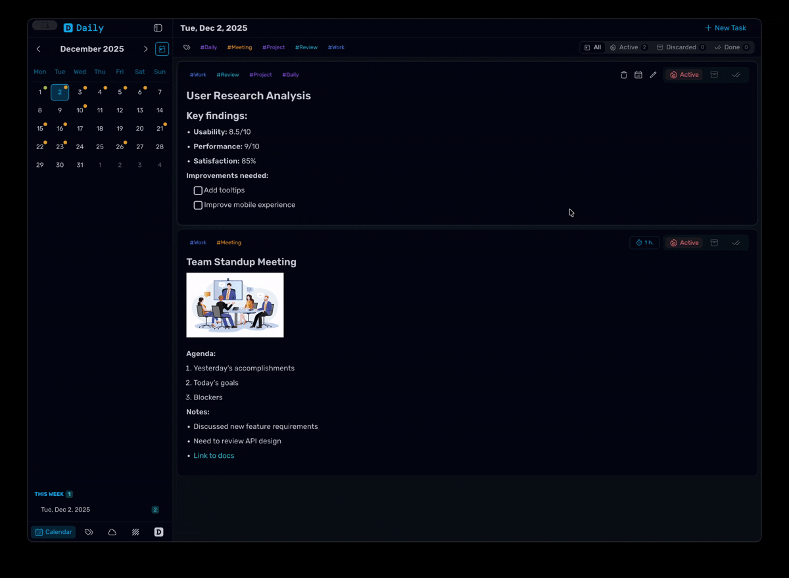
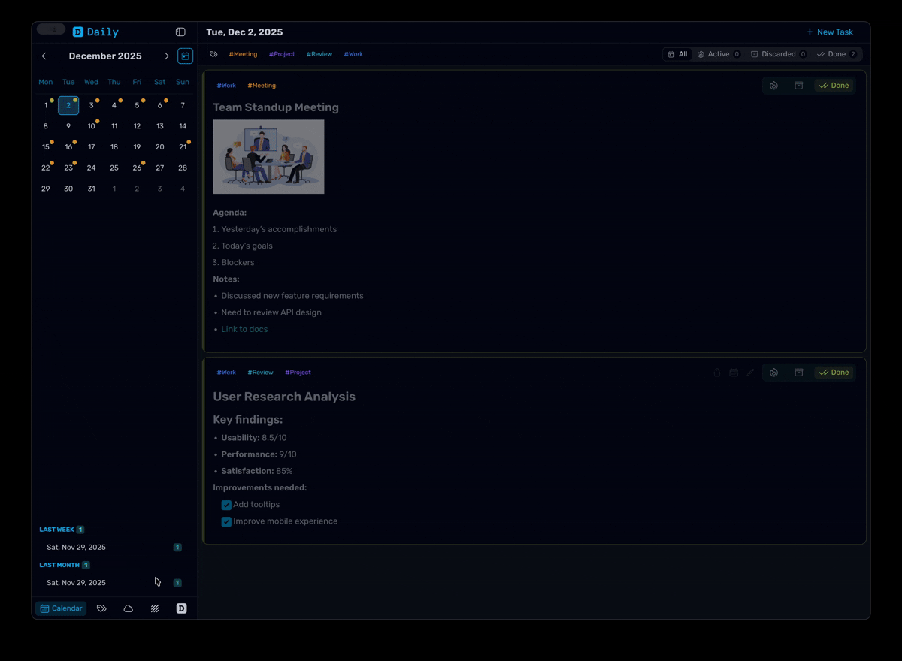
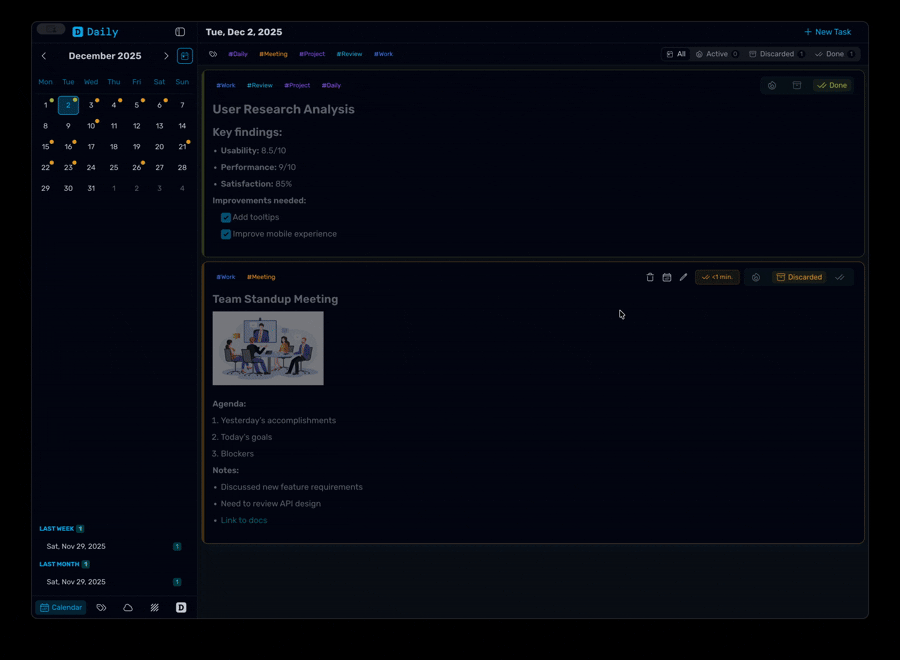
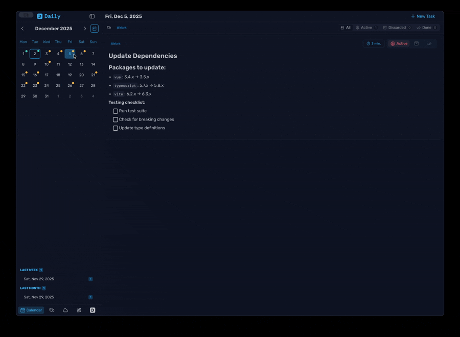
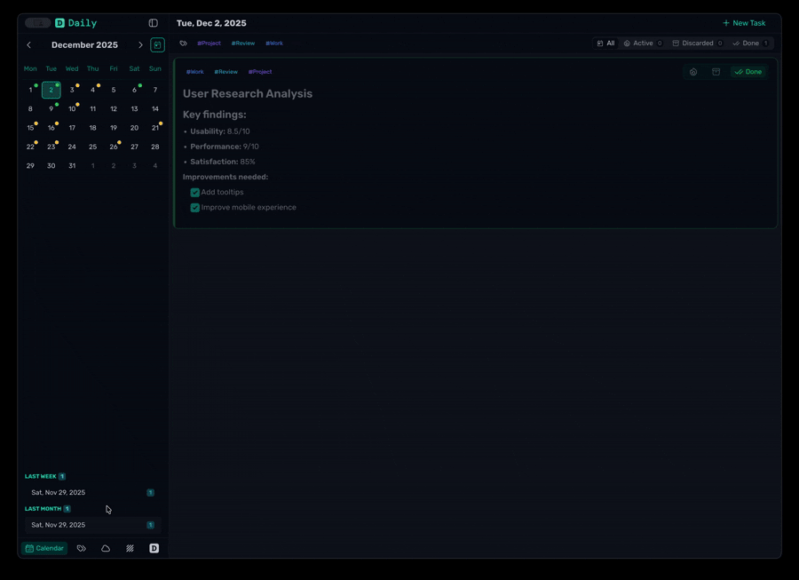
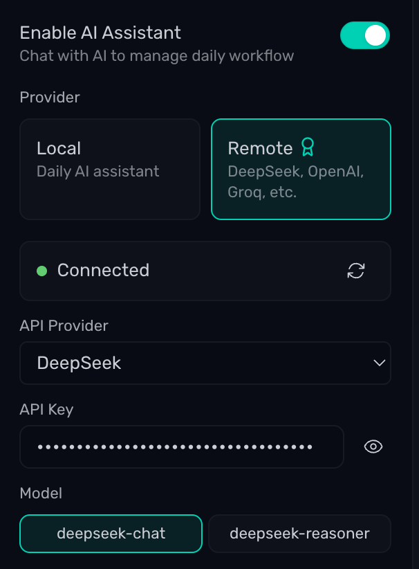
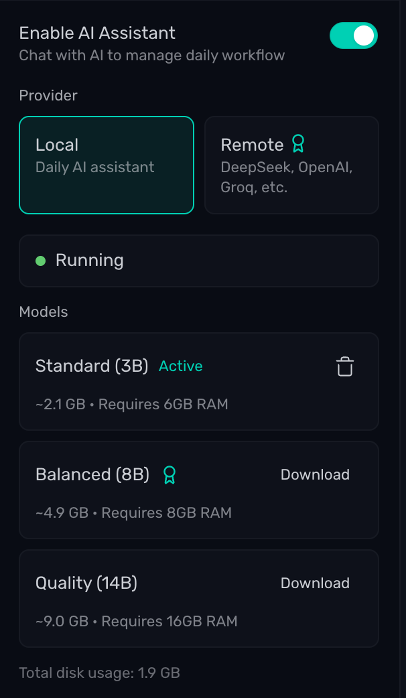

#  Daily

**Daily** — An AI-powered task management application focused on productivity, minimalism, and convenience.



---

### Idea 🤔

The idea came from my habit of organizing daily tasks in markdown, like:

```md
## Tuesday, Dec 17

- [x] Deploy to staging
- [ ] Write documentation
- [ ] Plan next sprint

## Monday, Dec 16

- [x] Review pull requests
- [x] Team standup meeting
- [ ] Complete feature implementation
```

I typically maintain my tasks organized by days, which allows me to revisit and track progress later.

This stems from the standard workflow requirement: "What I did yesterday, what I'm doing today" 📊

No bloat. No accounts. No complexity.
Just a lightweight, local-first tool to help you stay on track, one day at a time.

---

### ✨ Features

- **Day-centric workflow** 📅 — organize tasks by date, focus on what matters today
- **Calendar navigation** 📆 — jump to any day, review past work, plan ahead
- **AI Agent** 🤖 — executes tasks, tracks time, and manages your workflow — not just a chatbot
- **Local AI models** 🧠 — run the agent fully offline with llama.cpp and Metal GPU acceleration
- **iCloud sync** ☁️ — optional cross-device synchronization for seamless workflow
- **Fuzzy search** 🔍 — find any task instantly with intelligent fuzzy matching that handles typos
- **Rich task content** 📝 — markdown formatting, embedded images, file attachments
- **Time tracking** ⏱️ — estimate how long tasks will take, track actual time spent
- **Quick retrospectives** 🔄 — see what you did yesterday, plan what you'll do today
- **Smart organization** 🏷️ — group tasks by project, priority, or context with tags
- **Beautiful themes** 🎨 — choose from 9+ UI themes including Glass UI with blur effects
- **Local-first** 📁 — everything stored locally, works completely offline

---

## 🎬 Showcase

See Daily in action with these feature demonstrations:

<div align="center">

### ✅ Managing Tasks



### 🏷️ Tag Management



### ♻️ Delete & Restore Tasks



### ↔️ Move Task



### 🔍 Search Tasks


### ☁️ iCloud Sync



</div>

---

## 🤖 AI Assistant

Daily includes a built-in AI agent — not just a chatbot, but an assistant that executes tasks in your app.


### What it can do

- **Execute actions** ⚡ — creates, updates, and manages tasks
- **Multi-step operations** 🔄 — handles complex requests that require multiple actions
- **Work with your data** 📊 — searches tasks, reads schedules, analyzes your day
- **Understand context** 🧠 — knows dates, priorities, and your task organization

### Capabilities

- **Task management** ✅ — create, update, complete, discard, or delete tasks
- **Search and organize** 🔍 — find tasks across dates, move between days, batch operations
- **Tag management** 🏷️ — create tags, assign to tasks, organize by project or priority
- **Time tracking** ⏱️ — log time spent, adjust entries, compare estimates vs actual
- **Day summaries** 📊 — get overview of completion progress, time breakdown, what's left
- **Attachments** 📎 — view and remove file attachments from tasks

### Example interactions

- 💬 "Create a task to review the PR tomorrow at 2pm" → creates and schedules the task
- 💬 "I spent 2 hours on the documentation task" → logs time automatically
- 💬 "Complete all my work tasks for today" → finds and marks all work tasks as done
- 💬 "How's my day going?" → shows day summary with progress and time breakdown

### Two ways to run

| **OpenAI**                                                                          | **Local models**                                                                                                                            |
| ----------------------------------------------------------------------------------- | ------------------------------------------------------------------------------------------------------------------------------------------- |
| 🔑 Connect your API key for cloud-based models (e.g., GPT-4, DeepSeek, etc.)        | 🏠 Run everything offline with llama.cpp                                                                                                    |
| - Access to advanced cloud models<br>- Always up-to-date<br>- No downloads required | - Metal GPU acceleration on macOS for fast inference<br>- Three curated models: fast, balanced, or quality<br>- No data leaves your machine |
| - Configure API key and model in settings                                           | - Download and manage models directly in the app                                                                                            |
|                             |                                                                                       |

---

## 🎨 Glass UI

A translucent interface style with blur effects


---

## 💾 Data Privacy & Control

Daily stores everything locally on Mac — no accounts, no mandatory cloud dependency, no subscription fees.

### Rich Task Content

Create tasks with everything you need:

- **📝 Markdown formatting** — headers, lists, links, code blocks
- **🖼️ Images & Screenshots** — paste images directly with `Cmd+V` or drag & drop
- **⏱️ Time Tracking** — set estimates and track actual time spent
- **🏷️ Tags** — organize tasks by project, priority, or context

### Why Local-First Storage?

- 🔒 Private by default - tasks stay on the device unless sync is enabled
- ✅ Always available - work offline anytime, no internet required
- 💰 Zero cost - no required subscriptions or storage fees
- 🛡️ Safe and reliable - automatic conflict prevention and data integrity safeguards to reduce data loss risk
- 💾 Easy backup - simple export for backups or migration
- ☁️ Optional sync - enable iCloud sync when cross-device access is needed

---

### 🗺️ Coming Soon

- **Voice to task** 🎤 — voice recording to task

---

## 🚀 Installation

> [!NOTE]
> **macOS Only**: Daily currently supports only macOS. While Electron supports cross-platform deployment, Windows/Linux builds are not officially supported yet due to limited testing coverage.(or I'm just lazy 🤷‍♂️).

1. 📥 Go to [Releases](https://github.com/scheron/Daily/releases)
2. ⬇️ Download the `.dmg` file for macOS

> [!NOTE]
> The app is currently **not signed or notarized**:
>
> - **macOS** will show a Gatekeeper warning. Follow the terminal instructions below to remove quarantine.
>
> This is intentional, as Daily is open-source and not distributed through centralized stores.

---

### 💻 macOS

You can either:

- 📂 Open the downloaded `.dmg`
- 🖱️ Drag **Daily.app** to **Applications**
- 💻 Run this in terminal:
  ```bash
  xattr -rd com.apple.quarantine /Applications/Daily.app
  ```

Or ⚡ quick install via terminal:

```bash
curl -fsSL https://raw.githubusercontent.com/scheron/Daily/main/scripts/install/install-mac.sh | sh
```

> [!WARNING]
> `curl | sh` executes a remote script directly. Prefer downloading from Releases when possible.
> If you use the script, review it first

---

## 🔄 Updating

If installed via terminal script, 🔄 update using:

```bash
curl -fsSL https://raw.githubusercontent.com/scheron/Daily/main/scripts/install/update-mac.sh | sh
```

Or just ⬇️ download the latest version from the [Releases](https://github.com/scheron/Daily/releases) page.

---

Enjoy using **Daily** — organize tasks, own the days. ☀️
