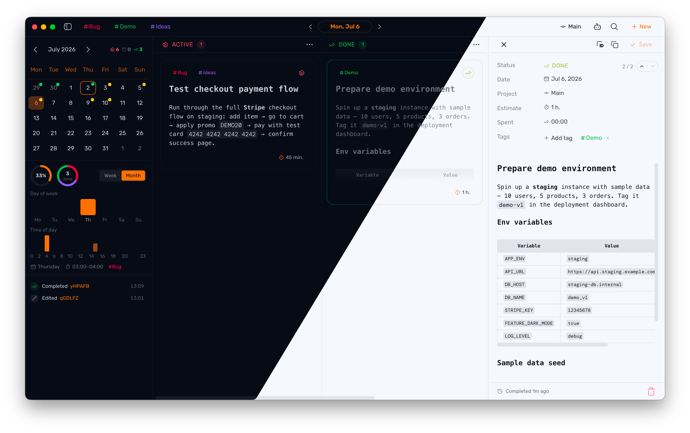
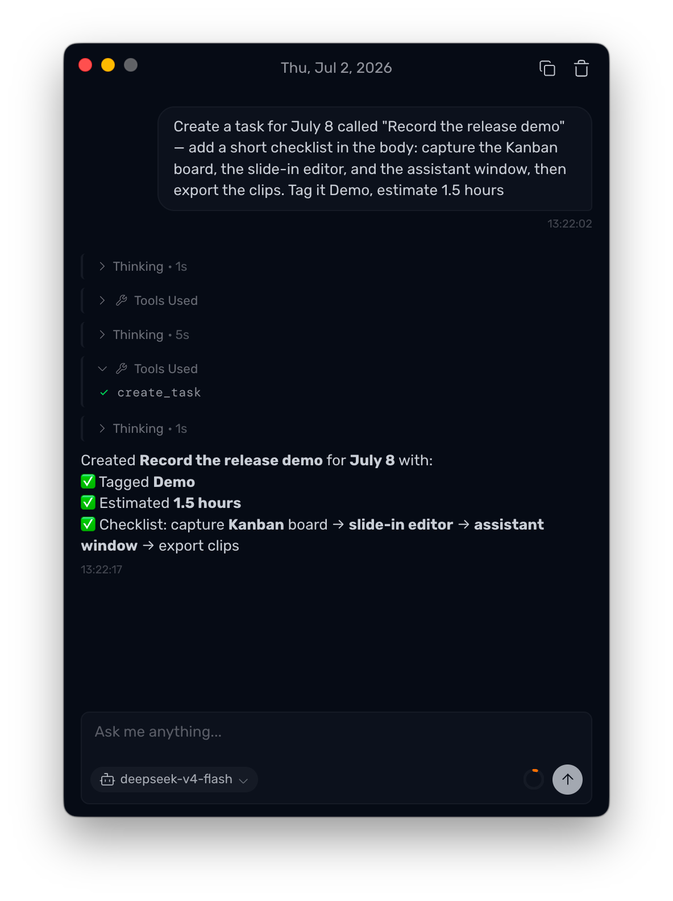

<p align="center">
  
</p>

<h1 align="center">Daily</h1>

<p align="center">
  <strong>Plan the day. Keep the context. Let the assistant do the task work.</strong>
</p>

<p align="center">
  A local-first, day-first task manager for Apple Silicon Macs.<br />
  Markdown tasks, SQLite storage, optional sync, a built-in task agent, and a CLI for automation.
</p>

<p align="center">
  <a href="https://github.com/scheron/Daily/releases">Download</a> ·
  <a href="#custom-task-agent">Task agent</a> ·
  <a href="#cli-for-automation">CLI</a> ·
  <a href="#privacy-and-data">Privacy</a>
</p>

<p align="center">
  <a href="https://github.com/scheron/Daily/releases">
    
  </a>
  <a href="https://github.com/scheron/Daily/releases">
    
  </a>
  <a href="./LICENSE">
    
  </a>
  
</p>



## How Daily works

### A day-first workspace

Daily is built around a simple question: **what matters today, and what changed since yesterday?**

Tasks belong to days instead of an endless backlog. Plan on a calendar-linked board, move work through **active**, **discarded**, and **done**, and keep notes, code, links, Markdown, and attachments inside the task.

| What you get | How Daily does it |
| --- | --- |
| **Day-first planning** | Calendar navigation and drag-and-drop rescheduling |
| **Context-rich tasks** | Markdown, code blocks, tables, tags, files, estimates, and logged time |
| **Separate workspaces** | Projects isolate task spaces and let you switch quickly |
| **Find old work** | Fuzzy full-text search across projects, dates, and task content |
| **See progress** | Activity history, task timelines, and daily, weekly, and monthly statistics |

### Built for daily task work

- A three-column board for active, discarded, and completed work
- A Markdown editor with syntax highlighting, live tables, slash commands, and attachments
- Projects, tags, estimates, time logging, duplicate/copy actions, and soft deletion with recovery
- Activity history that records meaningful task changes
- Light, dark, and system appearance modes with configurable accent colors and widgets

## Custom task agent

Daily has its own built-in task-agent runtime. It is not a chat widget connected to a model: Daily runs an agent loop that streams responses, executes registered task tools, preserves conversations, and gates destructive actions behind an explicit confirmation step.

The agent works through Daily's own task, project, tag, time, attachment, and summary operations. It does not claim to control arbitrary apps or files on your Mac.

<p align="center">
  
</p>

<p align="center">
  <em>The assistant streams its work and requests confirmation before destructive actions.</em>
</p>

Ask it to do task work such as:

- “Move unfinished work from today to tomorrow.”
- “Add 45 minutes to the release-notes task.”
- “What did I complete this week?”
- “Create follow-up tasks from these notes.”

### Choose your model

Use a downloadable local model to run inference on your Mac, or connect an OpenAI-compatible provider. Daily manages the local-model runtime and downloads, but local models still require disk space, memory, and an initial download.

## Privacy and data

Task data and conversation history are stored locally in SQLite. Attachments and downloaded local models are regular files on disk. No account is required.

Data leaves your Mac only when you choose a feature that needs it:

- A configured remote AI provider receives the relevant assistant prompts and context.
- Optional iCloud Drive or SSH sync stores sync snapshots in the remote you configure.
- Web-page reads are requested by the assistant and require confirmation before the first fetch.

## Install

### Homebrew

```bash
brew install --cask scheron/tap/daily
```

### Manual install

1. Download the Apple Silicon `.dmg` from [Releases](https://github.com/scheron/Daily/releases/latest).
2. Move **Daily.app** to **Applications**.
3. Open Daily.

Daily checks GitHub Releases for updates on launch. When an update is available, it can download and install the new app.

<details>
<summary>macOS blocks the first launch</summary>

Current builds may need this one-time command:

```bash
xattr -rd com.apple.quarantine /Applications/Daily.app
```

</details>

## CLI for automation

Daily ships a command-line companion for working with the same task workspace from a terminal.

```bash
npm install -g @scheron/daily-cli
```

```bash
daily today
daily tasks add "Review PR" --tags focus --estimate 90
daily tasks done a1b2
daily tasks search "release notes"
daily projects
```

For scripts and agents, commands support `--json`. Run this once for a machine-readable description of commands, arguments, outputs, and error codes:

```bash
daily schema --json
```

By default, the CLI can work directly with the installed desktop app's database. It can also run as a standalone sync node with its own database and configured sync folder. See the [CLI documentation](./src/cli/README.md) for all commands and node-mode details.

## Optional sync

Daily is fully usable offline. Sync is optional: SQLite remains the local source of truth, while iCloud Drive and SSH remotes carry snapshots that Daily merges locally with a last-write-wins strategy.

You can configure more than one remote. An unreachable remote does not block the others.

## Requirements and limits

| Component | Support |
| --- | --- |
| Desktop app | macOS on Apple Silicon only |
| CLI | macOS or Linux, with Node.js 22.5.0 or newer |
| Local AI models | Download required; available disk space and memory vary by model |
| Desktop builds for Windows/Linux | Not shipped or tested |

## License

[MIT](./LICENSE)
