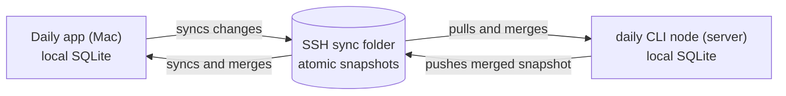

# @scheron/daily-cli

Daily task automation from the shell — the command-line companion to [Daily](https://github.com/scheron/Daily), a local-first, day-centric task manager for macOS.

Manage tasks, tags, and projects from the terminal against the desktop app's database, or run the CLI as a standalone **sync node** with its own database that stays in sync through a shared folder or over SSH.

## Install

```bash
npm install -g @scheron/daily-cli   # Node >= 22.5.0
daily --version
```

This provides the `daily` binary.

## Usage

```bash
daily today                              # today's tasks in the active project
daily tasks                              # list a day (default today)
daily tasks 2026-07-20 --project Work
daily tasks add "Review PR" --tags focus --estimate 90
daily tasks done a1b2                    # <id> = full id or a unique prefix
daily tasks move a1b2 2026-07-20 --time 09:30
daily tasks log-time a1b2 25
daily tasks delete a1b2                  # soft delete; --force purges
daily tasks search "release notes"
daily tags
daily projects
```

Task subcommands: `add`, `done`, `reactivate`, `discard`, `move`, `update`, `estimate`, `log-time`, `delete` (`--force`), `restore`, `deleted`, `search`. Tags: `tags`, `tags delete <id|name>`.

Scope any command with `--project <id|name>` or `--all`; without either, commands use the project active in the desktop app. Run `daily --help` or `daily <command> --help` for the full reference.

## Scripting & AI agents

Every command accepts `--json` (or set `DAILY_JSON=1` for the session) and prints a stable envelope:

- success (stdout): `{"ok":true,"data":{…}}`
- failure (stderr): `{"ok":false,"error":{"code":"…","message":"…"}}`

Exit codes: `0` ok · `1` usage · `2` invalid/ambiguous · `3` not found · `4` refused · `5` sync failed.

Run **`daily schema --json`** once for the full machine-readable contract — every command with its arguments, options, output shapes, error codes, and `Task`/`Tag`/`Branch` type definitions. An AI agent can drive Daily entirely from that.

```bash
DAILY_JSON=1 daily tasks
daily schema --json
```

## Direct vs node mode

**Direct mode (default).** The CLI reads and writes the installed Daily app's database directly (`~/Library/Application Support/Daily`). A running app watches for CLI edits and refreshes live. Use this on the same Mac as the app.

**Node mode.** The CLI keeps its own database (`~/.local/share/daily`) and syncs it through a folder — ideal for a headless machine or server with no app installed.

```bash
daily sync enable --dir ~/daily-sync   # switch to node mode
daily sync status                      # mode, folder, snapshot info
daily sync                             # one-shot pull-merge-push
daily sync disable                     # back to direct mode
```

In node mode the CLI pulls before and pushes after every mutating command (skip with `--no-sync`). The desktop Daily app can sync with that same folder over SSH (**Settings → Remote**), so a server running this CLI stays in sync with your Mac.

## How it works

The desktop app and a CLI node are equal sync peers. Each keeps a local SQLite database and exchanges an atomic snapshot through the configured folder; the folder is storage, not a server or a process that must stay running.



1. The app syncs its local changes to the configured SSH folder.
2. Before a node command, the CLI reads that snapshot and merges it into its own database.
3. After a node command changes data, the CLI writes the merged snapshot back to the folder.
4. On its next sync, the app reads and merges the node's changes.

This communication is **bidirectional**: create or edit tasks, tags, and projects from either the app or the CLI node. Sync is local-first and uses Last Write Wins when the same record changed on both sides; the newest `updated_at` value wins. You can run `daily sync` at any time to perform a one-shot merge and push without making a change.

The CLI never opens a connection to the app directly. It only needs access to the shared sync folder; the app needs SSH access to that same folder.

Config lives at `~/.config/daily/config.json`.

## Requirements

- macOS or Linux, Node.js ≥ 22.5.0
- The [Daily](https://github.com/scheron/Daily) desktop app for direct mode (node mode is standalone)

## License

MIT © Scheron
